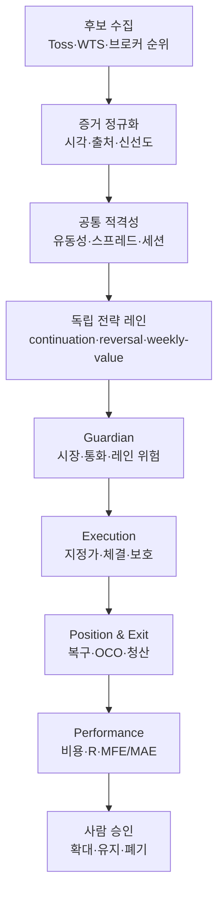

# TossOS 자동매매 전략 및 기술 설계

작성 기준일: 2026-08-11 · **개정 2026-08-11 (현재 HEAD `285c7619` 소스 대조 반영)**
근거 기준: 현재 HEAD 소스 대조, 2026-07 StockOS·TossOS 실측 기록, 공식 시장·브로커·연구 자료

> **개정 이력**
> 초판은 첨부 분석 문서의 commit 스냅샷을 사실 기준으로 삼았고, 그 스냅샷이 현재 HEAD보다
> 뒤처져 있었다. 대조 결과 초판의 핵심 진단 하나가 뒤집혔다 — **진입 루프와 전략 레인은
> 이미 존재한다.** 대조 근거 전문은 `docs/TossOS_설계문서_갭분석_2026-08-11.md`에 있다.
> 사용자 결정 4건(전략 논지·proposal 생성 모델·canary 수치·US 재무 출처)도 함께 반영했다.

## 1. 최종 결론

TossOS는 새로운 매매 아이디어를 더 넣기 전에 **이미 만들어 둔 진입 엔진을 여는 일**이 우선이다.
초판은 이 자리에 "진입 루프를 만들어야 한다"고 썼으나, 소스 대조 결과 그것은 사실이 아니었다.

- 실계좌 원장, 재시작 복구, 외부 보유 편입, reduce-only 자동청산은 이미 운영 경로에 있다.
- Guardian도 프로덕션 엔진에 연결되어 있다.
- **후보 verdict를 소비하는 프로덕션 진입 루프는 이미 존재한다** —
  `cmd/tossctl/engine.go:361`이 엔진의 네 번째 감시 루프로 전략 진입 supervisor를 띄우고,
  `runProductionStrategyMarketCycle → strategyDispatchCycle.dispatch → gateway.PlaceClaimedStrategy`까지 이어진다.
- **전략 레인도 이미 6개가 등록돼 있다** (`internal/strategyflow/registry.go:12-19`, KR/US × 3 horizon).
- 그럼에도 자동 진입은 **한 건도 발생할 수 없다.** 네 개의 구조적 latch가 잠겨 있기 때문이다(§1.1).
- 후보 자동 수집은 존재하지만 `seen_late`와 `extended` 승인 임계값이 없어 `passed=0`인 상태다. **(초판 진단 유지 — 확인됨)**
- 정정·취소는 2026-07-29 실계좌 재측정에서 브로커 수락까지 확인됐지만, 이것만으로 **신규 체결 직후 브로커 상주 보호주문이 항상 설치된다**고 볼 수는 없다. **(확인됨 — 초판보다 강함, §1.1 L2)**
- 성과 모델은 비용 후 손익, R, markout, MFE/MAE를 이미 계산한다
  (`internal/performance/model.go:110-202`, `internal/markout`). 초판이 지적한 공백은
  **모델이 아니라 그 모델을 채울 거래가 아직 발생하지 않는다는 것**이다.

### 1.1 진짜 blocker — 네 개의 구조적 latch

| # | Latch | 근거 |
| --- | --- | --- |
| **L1** | 레인 desired/effective가 `OFF`로 하드코딩되고 `ValidateDescriptors`가 OFF를 **강제**한다. 설정으로 켤 수 없다 | `strategyflow/registry.go:12-19,36`, 각 레인 `registry.go` |
| **L2** | 브로커 상주 보호가 미배선이라 `EntryPermitted=false` | `execgw/protection.go:61` — `ProtectionWired`에 "Nothing in this build produces this value". `app/engine/interlock.go:395`, `protection_wiring.go:38-41`(`Wired: false`, `"fill-lifecycle-unwired"`) |
| **L3** | 후보 veto threshold 전부 `unapproved` → `passed=0` | `candidate/threshold_descriptors.go:66-84` (`not_measured`, `ReadOnly: true`, writer 없음) |
| **L4** | proposal이 외부 서명 manifest에서만 복원되고 시장당 1건만 허용 | `strategyproposal/production.go`, `strategy_entry_supervisor.go:398` |

`internal/protectionofficial`(브로커 보호 게이트웨이)과 `internal/protectionlifecycle`(체결→보호 상태머신)은
**완성돼 있으나 외부 importer가 0**이다. 이는 사고가 아니라 의도된 봉인이며
(`protection/dormant_test.go:83`가 해당 심볼을 금지어로 검사한다), 해제는 그 테스트를 함께 바꾸는
change로만 가능하다.

> 따라서 이 문서의 P0는 "구현"이 아니라 **"측정 → 사람 승인 → 활성화 → 실측"**이다.

따라서 목표 구조는 다음과 같다.

> **TossOS = 다중 후보원 + 독립 전략 레인 3개 + 단일 주문 권위 + 체결 즉시 브로커 보호 + 레인/버전별 성과 귀속 + 사람 승인형 자본 재배분**

이 설계는 수익을 보장하지 않는다. 전략의 기대값은 아직 검증되지 않았다. 다만 StockOS에서 실제로 드러난 고점 추격, 늦은 발견, 타이트 손절, 유리한 후보 과잉 차단, 성과 귀속 부재를 TossOS에서 반복하지 않도록 구성한다.

## 2. 사실, 추론, 검증 가설의 분리

| 구분 | 내용 | 설계에서의 취급 |
| --- | --- | --- |
| ~~확인된 사실~~ **정정** | ~~후보 통과와 매수 소비자가 없다~~ → **매수 소비자(진입 루프)와 레인 6개는 존재한다.** 없는 것은 후보 통과(L3)뿐이다 | 진입 엔진 신규 구현이 아니라 **latch 해제**로 처리 |
| 확인된 사실 | Guardian·원장·복구·자동청산은 운영 경로에 연결돼 있다 | 새 엔진이 재사용해야 할 정본 |
| 확인된 사실 | 브로커 정정·취소 실측이 통과했다 | 주문 수명주기 능력의 일부로 인정 |
| 확인된 사실 | 브로커 상주 보호의 프로덕션 자동 설치는 별도 완결이 필요하다 | LIVE 진입 전 하드 게이트 |
| 확인된 사실 | 2026-07-14 StockOS 조기진입 5건은 모두 손절, 비용 후 약 -3,191.57원이었다 | 조기 추격 레인 초기 비활성 |
| 확인된 사실 | 수급 데이터가 필수일 때 미구현 `trading_flows` 때문에 관측 20건이 모두 `unknown`이 됐다 | 수급을 필수 게이트로 사용하지 않음 |
| 확인된 사실 (개정 추가) | `evidence.db`에 프로덕션 writer가 없다. `Store.Append`·`SealSnapshot`·`OfficialAdapter.CollectAndCommit`이 모두 테스트에서만 호출된다 | 서명 manifest는 **부재한 증거 파이프라인의 대역**이었다. 라이브 평가 전환의 실제 비용 |
| 확인된 사실 (개정 추가) | KR net flow 증거는 레인이 `AuthorityKRX`·`AuthorityTossOpenAPI`만 수용하는데 생산자가 없다 | 단기 레인은 **증거 출처부터** 신설해야 한다 |
| 확인된 사실 (개정 추가) | 승격 판정(`PROMOTE`/`SHELVE`/`INSUFFICIENT`)은 문자열조차 코드에 없다. `internal/optimization`은 설정 옵션 preview/apply 레지스트리다 | §10.3은 신규 구현 대상 |
| 확인된 사실 | 다수 extreme mover가 이미 오른 뒤 늦게 발견됐다 | 발견과 진입 랭킹 분리, 레인별 cadence 적용 |
| 연구로 지지되는 일반 가설 | 주가 모멘텀은 여러 시장과 중기 기간에서 관측돼 왔다 | 중기 레인 연구 근거로만 사용 |
| 미검증 가설 | RVOL 1.5배, 첫 리테스트, 몸통 비율이 TossOS에서 수익을 만든다 | 버전 고정된 실험 파라미터로 취급 |
| 근거 없음 | ‘세력이 모든 가짜 돌파를 설계한다’, ‘필터가 손실 80%를 줄인다’ | 전략 근거에서 배제 |
| 근거 없음 | 사례 2건의 레버리지 수익률이 전략 기대값을 증명한다 | 배제, 초기 레버리지 금지 |

학술 연구의 모멘텀 결과는 대체로 월 단위 또는 더 긴 기간의 현상이며, 1분봉 돌파의 수익성을 직접 입증하지 않는다. 예를 들어 Chan·Jegadeesh·Lakonishok의 연구는 중기 모멘텀을 다루므로, 이를 단기 리테스트의 증거로 확대 해석해서는 안 된다. [NBER 원문](https://www.nber.org/system/files/working_papers/w5375/w5375.pdf)

## 3. 설계 원칙

### 3.1 발견과 매수 권한을 분리한다

Toss/WTS 인기·거래량·투자자 순위는 **발견 증거**다. 계좌, 주문 가능 현금, 실제 호가, 수량, 체결, 보유, 보호주문은 **실행 브로커 어댑터의 권위**다. 보조 원천의 값으로 직접 주문 가격이나 보유 수량을 결정하지 않는다.

KIS를 실행 브로커로 사용하는 배포라면 공식 Open API의 국내·해외 주식 REST와 WebSocket 경로를 사용한다. 한국투자증권도 공개 저장소의 코드를 참고 예제로 규정하고 손실 책임을 보증하지 않으므로, 샘플 코드 존재를 주문 안전성의 증거로 간주하지 않는다. [한국투자증권 공식 Open API 저장소](https://github.com/koreainvestment/open-trading-api)

### 3.2 하나의 계좌에는 하나의 주문 권위만 둔다

`broker_id + account_id + market` 조합마다 하나의 `BrokerAuthority`만 주문을 생성한다. Toss와 KIS가 동시에 데이터를 제공하더라도 한 포지션을 두 엔진이 관리하면 안 된다. 다른 원천은 후보 증거나 독립 검증에만 사용한다.

### 3.3 전략 판단과 주문 안전을 분리한다

- 전략 레인: 무엇을, 왜, 어느 가격 구조에서 사고 싶은지 결정한다.
- Guardian: 그 주문을 지금 실행해도 되는지 결정한다.
- Execution: 지정가, 체결, 부분체결, 취소, 정정, 보호 설치를 책임진다.
- Position/Exit: 전략과 무관하게 보유를 복구하고 청산한다.
- Performance: 판단과 체결의 결과를 사후 계산하되 주문을 방해하지 않는다.

SEC의 알고리즘 트레이딩 보고서도 정상 시 유동성·시장 품질 개선 가능성과 함께 비정상 변동기 및 상호 연결된 시스템의 운영 실패 위험을 지적한다. 따라서 전략 신호보다 kill switch, 중복 방지, 보호주문, 장애 복구가 먼저여야 한다. [SEC 알고리즘 트레이딩 보고서](https://www.sec.gov/files/algo_trading_report_2020.pdf)

### 3.4 자동 최적화가 자동 LIVE 승격을 의미하지 않는다

시스템은 `PROMOTE`, `CONTINUE`, `SHELVE`, `INSUFFICIENT`를 계산할 수 있지만 자본 확대와 LIVE ON은 사람이 승인한다. 여러 파라미터를 반복 탐색할수록 우연히 좋아 보이는 백테스트가 선택될 확률이 높아진다는 백테스트 과최적화 연구 때문에, 같은 데이터로 튜닝과 평가를 반복하지 않는다. [The Probability of Backtest Overfitting](https://papers.ssrn.com/sol3/papers.cfm?abstract_id=2326253)

## 4. 목표 아키텍처



핵심 이벤트 체인은 다음 ID를 끝까지 보존한다.

`candidate_observation_id → entry_decision_id → order_intent_id → broker_order_id → fill_id → protection_plan_id → position_id → exit_fill_id → performance_attribution_id`

시간이 가깝다는 이유로 후보와 체결을 추정 조인하지 않는다. 외부 수동 편입은 `adoption_id`를 사용하고 엔진 진입 성과와 완전히 분리한다.

> **구현 현황** — ID 체인은 `internal/orderlineage`, `performance/lineage_reader.go`,
> `strategyruntime/lineage.go`에 대부분 존재한다. 다만 `protection_plan_id` 구간은 보호가
> 미배선이라 **링크가 비어 있다**(§8.2). a100이 이 공백을 메운다.

## 5. 후보 발굴과 공통 종목 선정

### 5.1 2계층 수집

**L1 발견**은 10~15초 간격의 저비용 순위·거래량·가격 스트림을 사용한다. 목적은 ‘오르기 전에 정답을 맞히기’가 아니라 상세 조회 우선순위를 빠르게 만드는 것이다.

**L2 확인**은 레인별 예약 슬롯으로 호가, 최근 봉, ATR, 기준선, 거래대금, 거래정지/VI 상태, 주문 가능 수량을 조회한다. 전체 후보를 상세 조회하지 않고 다음 우선순위를 사용한다.

1. 신규 진입한 순위 후보
2. 순위 가속도가 큰 후보
3. 세션 고가에서 과도하게 멀지 않으면서 거래량이 증가한 후보
4. 기존 레인의 `ARMED` 상태 후보
5. 보유·보호 관리 종목

보유·보호 조회 예산은 후보 발굴보다 항상 우선한다.

### 5.2 공통 하드 필터

다음은 모든 레인이 공유한다.

- 정규장이고 거래 가능 상태일 것
- 실시간 호가와 계좌 상태가 신선할 것
- 매수호가·매도호가가 정상이며 스프레드 비용이 전략 손절폭을 훼손하지 않을 것
- 최소 거래대금·체결 빈도를 충족할 것
- 당일 거래정지, VI, 급격한 데이터 단절 상태가 아닐 것
- 예상 진입가, 구조적 손절가, 목표가, 수수료·세금·환율 비용을 산출할 수 있을 것
- 비용 반영 계획 손익비가 초기 기준 2.0R 이상일 것
- 이미 동일 종목·동일 방향 주문 또는 포지션이 없을 것
- 레인·시장·통화·계좌 위험 한도 안일 것

`2.0R`은 입증된 최적값이 아니라 초기 안전 파라미터다. 2.0/2.5/3.0R 반사실 결과를 함께 기록하고, 실측 후 버전으로 변경한다.

### 5.3 KR 기관·외국인 순매수의 사용법

> **개정 주석 (D1: 코드 우선)** — 아래 랭킹 점수 체계는 **코드에 존재하지 않으며, 후속 과제로 미룬다.**
> 현재 `continuationlane`은 flow를 랭킹 가산점이 아니라 **레인 자체의 판단 근거**로 소비한다
> (`continuationlane/production_proposal.go:85`, `KindKRNetFlow`).
> 더 근본적으로 **KR net flow 증거의 생산자가 아직 없다** — 레인은 `AuthorityKRX` 또는
> `AuthorityTossOpenAPI` 출처만 수용하는데(`:86`), 그 출처의 수집기가 구현되지 않았다.
> StockOS의 `trading_flows`는 **WTS 출처**라 레인이 받지 않으므로 재사용할 수 없다.
> 따라서 이 절은 **a107(`source-kr-net-flow-evidence`)이 증거 출처를 세운 뒤에** 다시 판단한다.

전일 기관·외국인 순매수는 KR 후보의 **랭킹 가산점**으로 사용한다. 매수 필수조건이나 단독 진입 신호로 사용하지 않는다.

권장 초기 랭킹 구성은 다음과 같다. 점수 비중은 최적값이 아니라 v1 실험값이다.

| 요소 | 비중 | 이유 |
| --- | ---: | --- |
| 유동성·스프레드 품질 | 25 | 체결비용과 미체결 위험 통제 |
| 시간대 보정 상대 거래량 | 20 | 단순 20봉 평균보다 장중 계절성 완화 |
| 가격 구조 품질 | 20 | 고점 추격보다 지지·재탈환 우선 |
| 순위 가속도·신규 진입 | 15 | 늦은 발견 완화 |
| 전일 기관 순매수 percentile | 10 | 보조 수급 증거 |
| 전일 외국인 순매수 percentile | 10 | 보조 수급 증거 |

수급이 없거나 stale이면 해당 20점을 재정규화하지 않고 `flow_missing`으로 남긴다. 즉 80점 기준으로도 후보가 될 수 있어야 한다. 장중 잠정 수급은 `as_of`, 출처, 확정 여부를 저장하며, 확정 데이터와 섞지 않는다.

### 5.4 KR과 US의 차이

| 항목 | KR | US |
| --- | --- | --- |
| 추가 후보 근거 | 기관·외국인 수급, KRX 순위 | 정규장 거래량·갭·상대강도 |
| 초기 거래 시간 | 정규장만 | 정규장만 |
| 초기 제외 | VI·거래정지·상한가 근접 추격 | LULD halt, 초저가·극단적 스프레드 |
| 통화 한도 | KRW envelope | USD envelope |
| 소수점 | 초기 미지원 또는 전량 정책 | 브로커 능력 확인 후 별도 정책 |

US는 초기에는 09:30~16:00 ET 정규장 주문만 허용한다. Nasdaq의 정규장 주문 정의도 이 시간대를 사용한다. 연장장은 유동성·스프레드·가격발견 특성이 달라 별도 레인과 별도 위험 한도 없이 합치지 않는다. [Nasdaq 정규장 주문 시간](https://www.nasdaqtrader.com/trader.aspx?id=pricelisttrading2)

## 6. 운영할 독립 전략 레인

> **개정 (D1: 코드 우선)** — 초판은 S1(Breakout Retest) · S2(Momentum Pullback Reclaim) ·
> M1(Medium Trend Pullback)을 제안했으나, 코드에는 **다른 논지의 레인 6개**가 이미 구현·테스트돼
> 있다. 레인을 새로 만드는 대신 **있는 레인을 여는 쪽**을 택한다. 초판의 S1/S2/M1 설계는
> §6.5에 후속 과제로 보존한다.

초기 독립 레인은 **horizon 3종 × 시장 2개 = 6개**다. 각 레인은 KR과 US 파라미터 버전을 따로 갖되
동일한 상태 계약(`strategyflow.Descriptor`)을 사용한다. 전원 `Desired=OFF, Effective=OFF`이며
활성화에는 사람 승인이 필요하다(§11 a105).

| Market | Horizon | Lane ID | 논지 |
| --- | --- | --- | --- |
| KR | short | `kr_short_flow_continuation_v1` | 수급 흐름 지속 |
| US | short | `us_short_participation_continuation_v1` | 참여도 지속 |
| KR | short | `kr_short_absorption_reversal_v1` | 매물 흡수 후 반전 |
| US | short | `us_short_dislocation_reversal_v1` | 가격 이탈 후 반전 |
| KR | weekly | `kr_weekly_disclosure_value_v1` | OpenDART 공시 가치 재평가 |
| US | weekly | `us_weekly_disclosure_value_v1` | EDGAR 공시 가치 재평가 |

### 6.1 Continuation — 흐름·참여 지속

목적: 이미 확인된 자금 흐름 또는 참여 확대가 **지속되는 구간**을 매수한다. 세션 고가 추격이 아니다.

증거 계약(`continuationlane/evidence.go`):

- **KR**(`kr-flow-v1`) — `net_flow_notional_minor`, `turnover_notional_minor`, `flow_pressure_ppm`.
  즉 순매수 금액을 거래대금으로 정규화한 **흐름 압력**이 판단 단위다.
  수용 authority는 `AuthorityKRX` 또는 `AuthorityTossOpenAPI`뿐이다.
- **US**(`us-participation-v1`) — `participating_volume_shares`, `baseline_volume_shares`,
  `reference_price_minor`, `last_price_minor`, `participation_ppm`, `price_change_ppm`.
  즉 **baseline 대비 참여 배수와 가격 변화**가 판단 단위다. 수용 authority는 `AuthorityTossOpenAPI`뿐이다.

초판 S2(모멘텀 눌림 재탈환)와 **지속이라는 방향은 같지만 근거가 다르다** — S2는 가격 구조(눌림·재탈환)를
읽고, 이 레인은 수급·참여를 읽는다. 가격 구조 조건을 넣으려면 별도 증거 스키마가 필요하므로
§6.5의 후속 과제로 둔다.

### 6.2 Reversal — 흡수·이탈 후 반전

목적: 하락 뒤 **매물이 흡수되었거나 가격이 과도하게 이탈한** 지점의 반전을 매수한다.

- **KR**(`kr-absorption-v1`) — `absorption_ppm`을 중심으로 `MinimumAbsorptionPPM` 임계를 넘겨야 한다.
- **US**(`us-dislocation-v1`) — `dislocation_volume_shares`, `baseline_volume_shares`,
  `drawdown_ppm`, `relative_volume_ppm`. 낙폭과 상대 거래량을 함께 본다.

레인은 구조적 무효화선(`structural.go`)과 실행 조건(`execution_terms.go`)을 분리해 보유한다.

**이 레인은 초판에 대응물이 없었다.** 초판이 S1으로 제안한 돌파 리테스트와는 논지가 반대이므로,
S1을 나중에 추가하더라도 이 레인을 대체하지 않는다.

### 6.3 Weekly value — 공시 가치 재평가

목적: 장중 급등이 아니라 **공시로 드러난 가치와 가격의 괴리**를 주 단위로 거래한다.

- **KR** — OpenDART(`kr-opendart-weekly-value-v1`), authority `AuthorityOpenDART`
- **US** — EDGAR(`us-edgar-weekly-value-v1`), authority `AuthoritySEC`

증거는 `DisclosureEvidence`이며 point-in-time 필드를 요구한다 — `as_of`, `cutoff_at`,
`revision_id`, `superseded_revision_id`, `revision_sequence`, 그리고 `FinancialInputs`와
희석주식수. `CalculateRR`이 equity value와 fair value에서 손익비를 산출한다.

**이 레인은 초판 M1(일봉 20/60 추세 눌림)과 다르다.** 시간축만 비슷하고 논지는 가격 추세가 아니라
펀더멘털 공시다. 일봉 추세 레인이 필요하면 §6.5의 후속 과제다.

> **첫 활성화 대상은 KR weekly value다.** 전략적 우월성이 아니라 **증거 조달 가능성** 때문이다 —
> KR disclosure는 수집 transport(`official_source.go`의 `collectDART`)와 도메인 계약(StockOS
> `point_in_time.py`의 실측 계약)이 모두 존재한다. 반면 단기 레인의 KR net flow는 **수집기도
> 승인된 출처도 없다.** 초판 §15가 권한 "단기 레인 먼저"는 이 제약을 고려하지 않은 순서였다.

### 6.4 초기 비활성 — Opening Fast Chase

개장 직후 고가 돌파를 즉시 추격하는 레인은 초기 LIVE에서 제외한다. 이유는 이론이 아니라 StockOS
실측이다. 2026-07-14 체결 5건이 모두 손절이었고 확인신호 5개 중 3개가 배선되지 않은 채 세션 고가에서
진입했다. 향후 다음이 모두 충족될 때만 새 버전으로 재개한다.

- 거래량 지속성
- 고점 거리·추격 페널티
- drift cap
- 완성봉 또는 명시적인 microstructure 확인
- 비용 후 반사실 기대값
- 독립 lane/version attribution

TossOS에는 이 레인의 구현체가 없으므로 **미구현이 곧 비활성**이다.

### 6.5 후속 과제 — 가격 구조 레인 (초판 S1/S2/M1 보존)

아래는 초판 설계이며 **현재 코드에 대응물이 없다.** 6개 레인 중 하나가 수직 슬라이스를 통과한 뒤
7번째 레인으로 검토한다. 지금 착수하지 않는 이유는 논지가 나빠서가 아니라, **레인 하나를
후보→진입→보호→청산→성과까지 끝까지 증명하는 것이 먼저**이기 때문이다.

#### S1 — Breakout Retest Confirmed (후속)

돌파 직후 추격하지 않고, 완성봉 돌파와 첫 유효 리테스트 후 재탈환을 매수한다.

상태 흐름: `DISCOVERED → BREAKOUT_CLOSED → RETEST_WAIT → RECLAIMED → ARMED → SUBMITTED → FILLED`

초기 v1 조건:

1. 사전에 생성된 저항 기준선과 생성 시각이 존재한다.
2. 완성봉 종가가 저항 위에서 마감한다.
3. 봉 몸통/전체 범위, 윗꼬리 비율, 시간대 보정 RVOL을 기록한다.
4. 제한된 봉 수 안에 기준선 허용폭으로 재접촉한다.
5. 무효화선 아래 종가 없이 다시 기준선 위를 회복한다.
6. 재탈환 시점의 스프레드와 계획 손익비가 공통 필터를 통과한다.

초기 가설값 — breakout close buffer `max(1 tick, 0.10 ATR)`, retest tolerance `0.10~0.25 ATR`,
retest timeout KR 1분봉 8개·US 10개, RVOL 1.5 이상(1.2/2.0/2.5 반사실 병행 기록),
긴 윗꼬리 veto upper-wick/range 0.35 초과. **이 수치는 시장의 법칙이 아니라 재현을 위한 사전 고정값이다.**

무효화: 기준선 아래 종가, 리테스트 구간에서 거래량만 증가하고 재탈환 실패, timeout,
진입 전 스프레드 급증 또는 가격 drift 초과.

#### S2 — Momentum Pullback Reclaim (후속, §6.1과 부분 중복)

VWAP·돌파선·단기 EMA 중 사전 지정된 지지대 눌림과 재탈환에서 매수한다.
직전 impulse 이후 고점 대비 눌림 `0.5~1.5 ATR`, 눌림 저점이 구조적 무효화선을 깨지 않을 것,
지지대 재탈환 확인, day-high distance가 지나치게 가깝거나 overextended이면 차단.

§6.1 continuation과 **지속 논지가 겹치므로**, 추가한다면 continuation의 가격 구조 확장으로
설계하고 별도 레인으로 늘리지 않는다 — 적은 실거래가 여러 버전으로 분산되면 판정이 불가능해진다.

#### M1 — Medium Trend Pullback Continuation (후속)

일봉 20일·60일 추세 동행, 시장/섹터 대비 상대강도 양수, 20EMA·직전 돌파대·volume-profile 지지
구간 눌림, 일봉 또는 30분봉 재탈환, 예정 이벤트 근접 시 신규 진입 금지, 최대 보유기간·time stop 사전 확정.

이 레인은 단기 레인보다 stop이 넓으므로 같은 주문금액이 아니라 같은 **원화/달러 위험액**으로 크기를 정한다.

#### 중복 신호 처리 (전 레인 공통)

두 레인의 신호가 동시에 발생하면 중복 주문을 만들지 않고, 사전 정의한 우선순위로
**하나의 `entry_decision_id`만** 선택한다. 이 규칙은 현재 코드에 없으며 §11 a103에서 구현한다.

## 7. 포지션 크기와 위험 한도

초기 단계는 수익 극대화가 아니라 **실제 체결을 통해 기대값을 싸게 측정하는 단계**다. 계좌 전체의 2%를 한 거래에 위험시키는 방식은 검증 전 TossOS에 과도하다.

### 7.1 구조적 손절과 수량 공식

고정 -3%를 모든 종목에 적용하지 않는다.

`stop_price = 구조 무효화 가격 - 유동성/ATR buffer`

`risk_per_share = entry_price - stop_price + 예상 왕복 비용`

`quantity = floor(min(risk_budget / risk_per_share, notional_cap / entry_price))`

**초기 canary 값 — 사용자 승인 완료 (2026-08-11, D3)**

- 거래당 위험: `min(계좌 순자산 0.10%, 5,000원 상당)`
- **주문금액 상한: 전략 레인이 구조적 손절에서 역산한 값을 참조한다.** 고정 190,000원을 쓰지 않는다
- 일일 손실 한도: `min(계좌 순자산 0.25%, 12,000원 상당)`
- 일일 신규진입: KR 최대 2, US 최대 2, 전 시장 합계 최대 3
- 동시 신규 포지션: 레인당 1, 전 시장 합계 3
- 레버리지·신용·공매도: 초기 금지

> **구현 현황 — 공식의 절반만 있다.**
> `continuationlane/risk.go:73-110`의 `CalculateActualRisk`는
> `quantity × (entry − stop) + fees`를 FX 환산해 `RiskBudgetMinor`와 **대조(검증)** 만 한다.
> 수량은 `allocation.go:56` `PlannedQuantity`로 **입력받는다.**
> 즉 위 `quantity = floor(min(...))` 역산 경로가 없다. §11 a104가 이것을 만든다.
> 주문금액 상한을 "레인값 참조"로 정한 결정은 이 역산 경로 신설을 전제한다.

손절폭이 너무 좁아 시장 노이즈 안에 있거나 너무 넓어 주문금액이 의미 없게 되면 거래를 건너뛴다. StockOS에서 0.7~1.2% 손절이 약 129초 만에 반복 손실로 이어진 사실을 고려해, 단순히 더 타이트한 손절을 좋은 위험관리로 간주하지 않는다.

### 7.2 물타기와 불타기

- 손실 중 추가매수는 v1에서 금지한다.
- 수익 중 추가매수는 `+1R`, 보호선이 최소 진입가 이상으로 올라간 뒤 1회만 허용한다.
- 추가 수량은 최초 수량의 최대 50%다.
- 추가 후 총 개방 위험이 추가 전보다 증가하면 금지한다.

즉 ‘올라가면 더 사고 내려가면 더 산다’를 동시에 쓰지 않는다. TossOS 첫 버전은 손실 평균단가 낮추기가 아니라 **확인된 방향에만 위험 비증가형으로 추가**한다.

### 7.3 상관·시장 위험

KRW와 USD 한도를 하나의 통화 필드에 넣지 않는다.

- `risk_envelope_krw`
- `risk_envelope_usd`
- `global_equity_risk_krw`는 FX snapshot으로 환산한 조회용 총계
- 동일 테마·섹터 최대 2종목
- 동일 방향 시장 노출 상한
- 환율 누락 시 US 신규진입 차단, 기존 US 청산은 계속

## 8. 주문·보호·청산 설계

### 8.1 주문 상태 머신

`INTENT_CREATED → GUARDIAN_ALLOWED → SUBMITTED → ACKNOWLEDGED → PARTIAL/FILLED → PROTECTED → MANAGING → CLOSED`

실패 상태는 `REJECTED`, `EXPIRED`, `CANCELLED`, `PROTECTION_FAILED`, `RECOVERY_REQUIRED`로 분리한다.

필수 규칙:

- client order id는 `account + market + symbol + lane_version + decision_id` 기반으로 멱등 생성
- 시장가 매수 대신 가격 상한이 있는 marketable limit 사용
- 제출 직전 호가 drift 재검증
- TTL 초과 미체결 취소
- 부분체결 수량만 보호
- 재시작 후 브로커 미체결·체결·보유와 원장을 reconcile한 뒤 신규 진입 재개
- 분석·성과 DB 장애가 주문 루프를 막지 않지만, 원장·브로커 상태 불일치는 신규 진입을 막음

### 8.2 브로커 상주 보호는 LIVE의 필요조건

신규 체결 후 정해진 timeout 안에 브로커가 손절 보호를 수락해야 `PROTECTED`가 된다. 로컬 프로세스의 가격 감시만으로 보호된 것으로 표시하지 않는다.

> **현황 (개정 확인)** — 이 절은 현재 **미충족**이며 LIVE의 단일 최대 blocker다.
> `execgw/protection.go:61`에 `ProtectionWired`에 대해 "Nothing in this build produces this value"라고
> 명시돼 있고, `app/engine/protection_wiring.go:38-41`은 KR/US 모두 `Wired: false`와
> `"fill-lifecycle-unwired"` digest로 출하한다. 따라서 `interlock.go:395`의
> `EntryPermitted = (Protection == ProtectionWired)`는 항상 false다.
> 구현체(`internal/protectionofficial`, `internal/protectionlifecycle`)는 **완성돼 있으나 봉인**돼 있다.
> 해제는 §11 a100이 담당하며, 금지 심볼 테스트(`protection/dormant_test.go:83`,
> `app/engine/a071_security_review_test.go:28`)를 같은 change에서 갱신해야 한다.
>
> **지금 운영 중인 보호는 엔진 프로세스가 살아 있는 동안만 유효하다.** 엔진이 죽으면 손절도 사라진다.

1. 체결 delta 수신
2. 체결 수량만큼 stop/conditional 보호 주문 제출
3. 브로커 order id와 상태 수신
4. 보호 수량 합계가 보유 수량과 일치하는지 확인
5. 불일치 시 신규 진입 latch OFF
6. 보호 설치 실패 시 reduce-only 긴급 청산 또는 사람 승인된 fail-safe 실행

시장별로 native OCO, conditional stop, 정정, 취소, reduce-only, 소수점 지원 여부를 **실계좌 능력 매트릭스**로 관리한다. 정정·취소가 통과했다는 사실을 native OCO 지원으로 확대 해석하지 않는다.

### 8.3 청산 정책

초기 공통 정책은 기존 TossOS의 균형형·러너형·하이브리드 50을 재사용하되 레인별 선택을 버전 고정한다.

- S1: 빠른 무효화, 1R 이후 보호 강화, 1.5~2.5R 분할 또는 trailing
- S2: 지지대 재이탈 즉시 무효화, 고점 재돌파 실패 time stop
- M1: 일봉 구조 손절, 장중 노이즈로 임의 축소 금지, 최대 보유기간 적용

정수 수량이 4주 미만이면 25% 부분익절이 0주가 되는 문제가 있으므로 전량형 정책을 사용한다. 소수점은 브로커 능력, 잔량 보호, 수수료 계산이 검증될 때까지 신규 자동진입에서 제외한다.

## 9. Guardian 계약

Guardian은 다음 순서로 fail-closed 평가한다.

1. kill switch와 운영 모드
2. 시장 세션·휴장·거래정지
3. 데이터 freshness와 broker health
4. broker-resident protection capability
5. 중복 주문·기존 포지션
6. lane LIVE latch와 lane/version
7. 종목 allow/deny 및 유동성
8. 계획 손익비와 구조적 stop
9. 수량, 현금, 통화 envelope
10. 거래당·일일·총 노출·상관 한도
11. 재진입 cooldown
12. 최종 호가 drift와 spread

중요한 운영 규칙은 **진입 OFF가 기존 포지션 청산 OFF를 뜻하지 않는 것**이다. 후보원, 전략, 신규 주문, 성과 projector가 모두 꺼져도 reconcile과 보호·청산 루프는 계속 실행한다.

## 10. 성과 측정과 레인 자본 배분

### 10.1 공식 성과 모집단

- 엔진 진입: `adoption_id IS NULL`이며 완전한 `entry_decision_id`가 있는 거래
- 외부 편입: 별도 표와 별도 KPI
- 동일 market + lane + lane_version + exit_policy_version + risk_profile_version만 한 cohort
- 수수료·세금·FX 누락은 0이 아니라 `not_measured`
- 미체결과 거절 후보도 기회비용 분석 모집단에 유지

### 10.2 반드시 기록할 지표

- 후보 수, 적격 수, 주문 수, 체결 수, 보호 성공 수, 청산 수
- 비용 후 순손익과 거래당 기대값
- 승률, 평균 이익, 평균 손실, Profit Factor
- 실현 R, MDD, downside deviation 또는 CVaR
- 진입·청산 슬리피지
- 5/15/30분 markout
- MFE, MAE, 보유시간
- 거절 사유별 놓친 수익과 회피 손실
- 데이터·수수료·FX·계보 완전성
- 레인 간 동시 신호·상관 노출

### 10.3 소액 LIVE와 승격 판정

> **구현 현황** — 아래 판정 계약은 **코드에 존재하지 않는다.** `PROMOTE`/`SHELVE`/`CONTINUE`/
> `INSUFFICIENT` 문자열도, bootstrap 신뢰구간도, OOS 분할도, CVaR도 없다.
> `internal/optimization`은 설정 옵션의 preview/apply/rollback 레지스트리이지 통계 승격 엔진이 아니다.
> §11 a113이 신규 구현한다. 반면 §10.2의 지표(markout 5/15/30, MFE/MAE, slippage, `not_measured`)는
> `internal/performance/model.go:110-202`와 `internal/markout`에 **이미 구현돼 있다.**

12주 가치검증을 기다리지 않고 P0 안전조건이 끝난 즉시 소액 LIVE로 들어갈 수 있다. 다만 ‘거래 시작’과 ‘자본 확대’ 기준은 분리한다.

**CANARY LIVE 시작 조건**

- 브로커 보호주문 E2E 실측 성공
- 진입→체결→보호→정정/취소→청산 잔여물 0
- 시장별 kill switch와 일일 손실 cap 실측
- lane/version attribution 누락 0
- 한 주문 권위 확인
- 운영자가 force-flat 가능

**PROMOTE 초기 기준**

- 동일 cohort 적격 기회 100개 이상
- 비용 완전 완결 거래 60개 이상
- 거래일 20일 이상
- 시간순 후반 1/3 OOS, 최소 20건
- 비용 후 기대값 bootstrap 95% 신뢰구간 하한이 0 초과
- PF, MDD/CVaR, 슬리피지, 데이터 완전성 동시 통과
- 외부 편입, 누락 FX, 불명확 계보 제외

판정:

- 하한 > 0: `PROMOTE_CANDIDATE`
- 상한 ≤ 0: `SHELVE_CANDIDATE`
- 그 외: `CONTINUE`
- 표본·완전성 부족: `INSUFFICIENT`

이 기준도 절대 진리가 아니라 과최적화와 소표본 착시를 줄이기 위한 사전 계약이다.

### 10.4 승률이 높은 레인으로 비중을 늘리는 방법

승률만으로 배분하지 않는다. 손익비가 다른 레인은 승률 비교가 왜곡된다. 다음 보수 점수를 사용한다.

`allocation_score = 기대값 신뢰구간 하한 × 체결률 × 데이터완전성 ÷ (1 + drawdown_penalty + slippage_penalty)`

배분 규칙:

- 최초에는 레인별 같은 거래당 위험액 사용
- `PROMOTE_CANDIDATE`만 확대 대상
- 한 번의 검토에서 위험액 최대 25% 증가
- 어느 한 레인도 전체 자동매매 위험 예산의 50% 초과 금지
- 최근 rolling window가 중단 기준을 위반하면 즉시 이전 위험액으로 rollback
- 자동 계산은 preview까지만, 실제 적용은 사람 승인

## 11. 구현 순서

> **전면 개정** — 초판 P0의 5개 항목(`add-protection-orders`, `approve-candidate-veto-thresholds`,
> `add-strategy-engine`, `add-market-aware-scheduler`, `add-multi-market-risk-envelope`)은
> **이미 archive된 완료 change**다(a045~a048, a066). 남은 일은 구현이 아니라
> **측정 → 사람 승인 → 활성화 → 실측**이다.
> 사용자 결정 D2(엔진 내부 라이브 평가)에 따라 증거 파이프라인 작업이 추가됐다.
> 상세 근거는 `docs/TossOS_설계문서_갭분석_2026-08-11.md` §6을 본다.

### 의존 그래프

```text
a100 보호 배선 ─────────────┬────────► a105 레인 활성화 권위 ──┐
a101 threshold 승인 ──┐     │                                  ├─► a106 실계좌 수직 슬라이스
a102 KR 공시 증거 ────┴─► a103 라이브 평가 ─► a104 손절 역산 사이징 ─┘
```

`a100` · `a101` · `a102`는 서로 독립이므로 병행 가능하다.

### P0 — LIVE 진입 전 필수 (범위: KR weekly value 레인 **하나**)

1. **a100 `wire-fill-to-broker-protection`** — L2 해제. 체결 delta → 보호주문 제출 →
   broker order id 수신 → 보호 수량 = 보유 수량 검증 → 불일치 시 진입 latch OFF →
   설치 실패 시 reduce-only 긴급 청산. 금지 심볼 테스트 2곳을 같은 change에서 갱신한다.
   **`ProtectionWired`를 생산하는 유일한 경로를 만든다.**
2. **a101 `measure-and-approve-candidate-thresholds`** — L3 해제. `seen_late`·`extended`·`near_high`의
   sample_count·missing_rate·evidence_digest 실측 후 `human_activation_record`로 사람 승인값을
   immutable option으로 고정. **`passed>0`을 최초로 만든다.**
3. **a102 `pipe-kr-disclosure-evidence`** — `OfficialBatchSink` 구현체(= `evidence.db` writer) +
   `OfficialAdapter` 구동 루프 + 사이클별 `SealSnapshot`. KR OpenDART 도메인 계층을
   StockOS 실측 계약으로 Go 재구현한다(§11.1). 공식 API 호출을 retry matrix·rate 예산에 계상한다.
4. **a103 `evaluate-lanes-in-engine`** — L4 해제. 서명 manifest 경로 은퇴, 엔진 내부 라이브 평가로 교체.
   `len(entries) != 1` 해제(N건), 레인 간 동시 신호 중복 제거(하나의 `entry_decision_id`),
   멱등 decision 생성. `strategydispatch`/`strategyruntime`과 `strategy_dispatch_cycle.go`의
   계약 이중화를 이 change에서 해소한다.
5. **a104 `size-from-lane-structural-stop`** — §7.1 역산 경로 신설 + D3 승인값을 Guardian·riskbucket에 고정.
6. **a105 `activate-a-lane-under-authority`** — L1 해제. 레인 desired/effective를 하드코딩 OFF에서
   권위 기반 상태로 전환하고 `deployguard`의 dormant 기준을 함께 개정한다.
   **한 번에 한 레인·한 시장만 ON.** 사람 승인 필수. **a100 없이 착수하지 않는다.**
7. **a106 `prove-one-live-vertical-slice`** — §13 수직 슬라이스를 KR weekly value 레인 하나로 통과.

**a100·a103·a105는 High-risk 경로다.** proposal 작성 **전에** Pre-Edit 선언과 `tools/logic-map`
AST 산출물을 만든다(`docs/WORKFLOW.md`).

### P0.5 — 나머지 레인 확장 (증거 출처 신설)

- **a107 `source-kr-net-flow-evidence`** — KR 기관·외국인 순매수를 **KRX 또는 Toss Open API** 출처로
  신설해 `KindKRNetFlow`를 생산한다. KR continuation·reversal 레인이 처음으로 평가 가능해진다.
  StockOS의 flow는 WTS 출처라 재사용할 수 없다.
- **a108 `source-us-participation-evidence`** — US participation 증거를 Toss Open API 출처로 신설.
- **a109 `source-us-edgar-financials`** — `data.sec.gov` XBRL companyfacts 계약 1건 추가
  (어댑터·rate budget·credential 프로필 재사용) + taxonomy 기준 매핑표(§11.2).

### P1 — 수익성 증거 완결

- **a110** `reconcile-profitability-evidence-contract`
- **a111** `project-complete-trade-performance`
- **a112** `measure-refused-entry-counterfactuals`
- **a113** `precommit-strategy-promotion-criteria` — §10.3 전량 신규 구현
- **a114** `operate-profitability-experiment`

§10.4 자본 재배분(`allocation_score`)은 a113 이후 별도 change. preview까지만 자동, 적용은 사람 승인.

### P2 — 운영 확장

- 종목별 정책 override/release/force-flat
- 소수점 수량
- 후보원 확대와 뉴스·이벤트 위험
- 리서치 replay와 파라미터 비교
- 모바일 UI

REST API + SSE/WebSocket 상태 스트림은 `internal/httpapi`가 이미 존재하므로 **신규가 아니라 확장**이다.

### 11.1 StockOS 이식 방침 (KR 공시)

StockOS `packages/trading/stockos_trading/dart/`(Python 3,723줄)에서 **코드가 아니라 실측 계약을**
가져온다. 언어가 다르고(`docs/ROADMAP.md`도 "검증된 거래 불변조건·순수 로직만 선별 이식"으로 규정),
HTTP 수집 계층은 TossOS `official_source.go`가 이미 Go로 더 엄격하게 갖추고 있다.

이식 대상 — `point_in_time.py`의 실측 계약 3건:

1. **정정 표시는 `report_nm` 접두이지 `rm`이 아니다.** `rm`은 시장·공시 구분 코드(유/코/공/정/연)로
   정정과 무관함이 실측 확인됐다. `정정신고서제출요구`는 감독당국의 정정 *요구*이지 정정 공시가
   아니므로 별도 분류한다 — 요구를 정정으로 세면 정정 이력이 부풀려져 as-of 조회가 정상 구간을 잘못 막는다.
2. **귀속 접수번호를 확정할 수 없으면 저장하지 않는다(fail-closed).** `rcept_no`가 없거나
   타임라인에 없으면 값을 추측해 넣지 않는다.
3. **결측과 명시 0을 구분한다.** §10.1의 `not_measured` 규율과 같은 원칙이다.

`red_flags.py`의 등급 배치 근거도 함께 인용한다: BLOCK에는 **되돌릴 수 없는 종류의 위험만** 넣고,
ROE 미달·부채비율·상승여력 같은 **품질 지표는 BLOCK에 넣지 않는다** — 단기 레인에서는 저평가가
아니어도 상승할 수 있고, 이를 공통 하드 게이트로 만들면 단기 레인이 근거 없이 굶는다.
StockOS 자신이 red flag 판정을 **관측 전용**으로 못박았으며 TossOS도 게이트로 쓰지 않는다.

이식하지 않는 것: `client.py`·`collector.py`(TossOS가 이미 보유), `backfill.py`·`status.py`(canary 규모에 불필요).

### 11.2 US EDGAR 재무 계층 출처

선행 확인 — **토스 Open API에는 재무·공시 데이터가 없고**(`internal/official/`는 시세·주문·계좌만),
US weekly 레인은 authority를 `AuthoritySEC`로 코드에 고정한다
(`weeklyvaluelane/production_proposal.go:123,150`). 따라서 SEC/EDGAR가 유일한 경로다.

`collectSEC`는 이미 `https://data.sec.gov/submissions/CIK##########.json`을 소비한다
(`strategyevidence/source.go:152`에 endpoint identity 하드 핀). 재무 수치는 **같은 호스트의 XBRL
companyfacts 리소스**를 같은 어댑터로 치면 되며, `validateOfficial()`이 계약을 하드 핀하므로
**새 `SourcePolicy` 계약 1건 추가**가 작업의 실체다.

매핑 지점은 한 곳이다 — `weeklyvaluelane.FinancialInput`은 `{Name, ValueMinor, Unit}` 세 필드뿐이므로
(`types.go:73-77`) **XBRL 표준 element name을 `Name`에 그대로 실으면 매핑이 성립한다.**
필요한 것은 파서가 아니라 **어떤 element를 어떤 계층에서 고를지에 대한 표준 근거**다.

| 출처 | 쓰임 |
| --- | --- |
| **SEC 공식 XBRL Taxonomies** (연도별·분기별 아카이브) | SEC 승인 US GAAP 표준 계정과목의 계층·아키텍처 가이드. **정본** |
| **FASB Taxonomy Viewers** | 자산·부채·자본·매출 전체를 부모-자식 트리로 열람. depth와 표준 element name 확인 |
| **FASB Taxonomy Online Search** | 특정 계정과목(예: `CashAndCashEquivalents`)의 상위 계층·하위 구조 검색 |
| **EdgarTools — XBRL Standardization Concepts** | 대형 금융정보사가 매핑하는 핵심 80~150개 표준 재무 라인 아이템 범위 산정 |

미국 상장기업은 재무제표를 XBRL 구조로 계정 과목의 상하 관계를 설정해 제출하므로 위 taxonomy가
**계층의 권위**다. 임의로 고른 element 집합을 재무 입력으로 삼지 않는다.
EdgarTools는 Python OSS이므로 **매핑표와 표준화 개념만 참조하고 코드는 이식하지 않는다** —
인용 시 라이선스를 확인하고 출처를 spec delta에 남긴다.

taxonomy가 풀어주지 못하는 미지수 3건은 a109 design에서 fixture로 확정한다:
① companyfacts는 최신 사실을 반환하므로 정정(10-K/A)이 과거 값을 덮을 때 `as_of`·`cutoff_at`·
`superseded_revision_id` 재구성이 되는지 **실측 필요**(KR과 달리 US는 선례가 없다),
② `ValueMinor` 스케일 ↔ XBRL `decimals`/`unitRef` 대응, ③ 희석주식수 element 선택.

## 12. 핵심 인터페이스

> **개정** — 아래는 초판의 제안형 인터페이스다. 코드는 **단일 `StrategyLane` 인터페이스를 쓰지 않고**
> 레인마다 순수 evaluator를 두고 `strategyflow.Descriptor`로 계약을 통일하는 구조를 택했다.
> 레인이 persistence·broker·exit·activation 권위를 갖지 않도록 하기 위한 설계이며
> (각 패키지 doc comment가 "pure, dormant … owns no persistence, broker, exit, or runtime-toggle
> authority"로 명시한다), 이 방향을 유지한다.

**현재 코드의 실제 계약**

- 레인: 패키지별 순수 함수 — `continuationlane.Evaluate*` / `reversallane.Evaluate*` /
  `weeklyvaluelane.Evaluate*`, 그리고 `production_proposal.go`가 증거 → 제안으로 변환.
  공통 식별은 `strategyflow.Descriptor{Market, Horizon, LaneID, LaneVersion, Release, Desired, Effective, Runtime}`.
- 브로커 권위: 단일 인터페이스가 아니라 `execgw.Gateway`(주문 수명주기) + `internal/official`(공식 API 어댑터)
  + `internal/reconcile`(대사)로 분리. **`PlaceProtection` 등가물은 `internal/protectionofficial`에
  존재하나 미배선**이다(§8.2).

초판 제안(참고용 보존):

```go
type StrategyLane interface {
    ID() LaneID
    Version() LaneVersion
    Observe(ctx Context, candidate CandidateEvidence) (LaneObservation, error)
    Decide(ctx Context, observation LaneObservation) (EntryDecision, error)
}

type BrokerAuthority interface {
    SnapshotAccount(ctx Context) (AccountSnapshot, error)
    Quote(ctx Context, symbol Symbol) (AuthoritativeQuote, error)
    SubmitEntry(ctx Context, intent OrderIntent) (BrokerOrder, error)
    PlaceProtection(ctx Context, plan ProtectionPlan) (ProtectionReceipt, error)
    Amend(ctx Context, req AmendRequest) (BrokerOrder, error)
    Cancel(ctx Context, req CancelRequest) (BrokerOrder, error)
    Reconcile(ctx Context) (BrokerState, error)
}
```

`CandidateEvidence`에는 값뿐 아니라 `source`, `observed_at`, `as_of`, `fresh_until`, `quality`, `missing_reason`이 있어야 한다. 값이 없다고 0으로 대체하지 않는다.

`EntryDecision`에는 최소한 다음을 저장한다.

- market, symbol, side
- lane_id, lane_version
- evidence digest
- planned entry, stop, target, expected costs
- planned gross/net R:R
- quantity와 risk budget
- 결정 시각과 만료 시각
- allow/reject, reject stage, reject reason

## 13. 검증 시나리오

### 안전 회귀

- 보호 불가능하면 신규 매수는 0건이고 기존 청산은 계속된다.
- 프로세스 중단 후 브로커 보호는 남아 있고 재기동 시 정확히 복구된다.
- 부분체결 수량보다 많은 보호·청산 주문이 생기지 않는다.
- 중복 decision 재생으로 중복 주문이 생기지 않는다.
- KRW 한도 장애가 USD 청산을 막지 않고, USD 한도 장애가 KR 청산을 막지 않는다.
- 수급 데이터 누락이 모든 후보를 `unknown`으로 만들지 않는다.
- 성과 projector 실패가 주문을 중단하지 않는다.
- 브로커·원장 불일치는 신규 진입을 차단한다.
- lane OFF 후에도 기존 포지션은 종료까지 원래 exit policy로 관리된다.

### 성과 회귀

- 외부 편입 수익이 엔진 레인 손실을 가리지 못한다.
- 서로 다른 lane/version/policy/risk profile이 합쳐지지 않는다.
- 비용·FX 누락이 0으로 계산되지 않는다.
- projector 재실행으로 중복 성과 행이 생기지 않는다.
- 거절 후보 분석이 주문 API를 호출하지 않는다.
- 승격 계산이 LIVE 설정을 자동 변경하지 않는다.

### 실계좌 수직 슬라이스

1. 가장 유동적인 단일 종목, 최소 수량
2. 진입 limit 제출과 ACK
3. 부분 또는 전량 체결 확인
4. 보호주문 제출과 broker order id 확보
5. 보호 정정 및 취소 재측정
6. reduce-only 청산
7. 원장·계좌·미체결 주문 잔여물 0
8. attribution·비용·R·markout 생성

## 14. 하지 말아야 할 것

- `세력`, `기관 의도`, `오더블록` 같은 해석어를 관측값 없이 주문 근거로 저장하지 않는다.
- 거래량 1.5배나 첫 리테스트를 보편적 진리로 하드코딩하지 않는다.
- 여러 레인의 결과를 합쳐 전체 승률 하나로 승격하지 않는다.
- 손절을 일률 -3% 또는 -0.7%로 정하지 않는다.
- 유리한 백테스트 하나를 고른 뒤 같은 기간으로 성과를 주장하지 않는다.
- 보호주문이 없는 상태에서 ‘소액이니 괜찮다’며 LIVE 진입을 연결하지 않는다.
- 후보 공급자와 주문 브로커의 보유·호가가 다를 때 임의로 한쪽을 선택하지 않는다.
- 분석 또는 LLM이 주문 수량·가격·kill switch의 최종 권위를 갖게 하지 않는다.

## 15. 최종 권고안

TossOS의 수익 구조는 **새 지표를 많이 넣는 것**이 아니라 다음 다섯 연결을 완성하는 데서 시작한다.

1. 늦지 않은 후보 발굴
2. 독립 레인별 재현 가능한 진입
3. 체결 즉시 브로커 상주 보호
4. 비용·FX·거절 후보까지 포함한 성과 귀속
5. 기대값과 낙폭에 따른 사람 승인형 자본 재배분

**개정된 초기 운영 순서** — 초판은 "S1·S2를 먼저"라고 권했으나, 그 순서는 **증거 조달 가능성을
고려하지 않은 것**이었다. 실제로 가장 짧은 경로는 **KR weekly value 레인 하나**다(§6.3).
KR 공시는 수집 transport와 도메인 계약이 모두 존재하는 반면, 단기 레인의 KR net flow는
수집기도 승인된 출처도 없다. 레인 하나가 수직 슬라이스를 통과한 뒤 단기 레인을 연다.

조기 고점 추격은 비활성으로 유지한다. 거래당 원금 비율보다 구조적 손절을 먼저 계산하고,
**주문금액은 위험액에서 역산한다** — 고정 상한이 아니라 레인이 산출한 값을 참조한다(§7.1, D3).

가장 중요한 출하 기준은 ‘신호가 하나 나왔다’가 아니다.

> **후보→진입→체결→브로커 보호→청산→잔여물 0→비용 후 성과 귀속이 한 번의 실계좌 실행에서 끊김 없이 증명되는 것**

이 수직 슬라이스가 통과한 뒤에는 12주를 기다릴 필요 없이 합의된 소액 canary를 시작할 수 있다. 그러나 자본 확대는 최소 표본, OOS, 비용 후 기대값의 신뢰구간이 충족될 때만 허용한다. 이것이 ‘바로 실전’과 ‘사실에 근거한 운영’을 동시에 만족시키는 TossOS 설계다.

