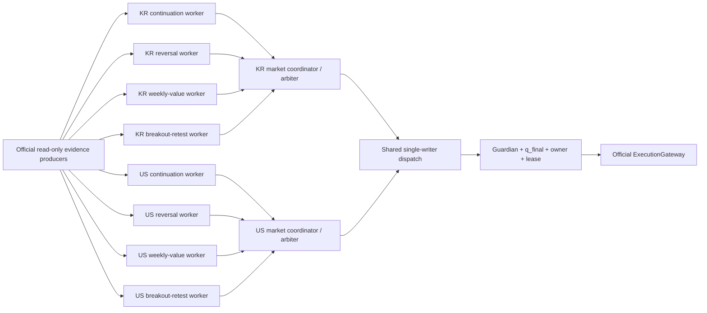
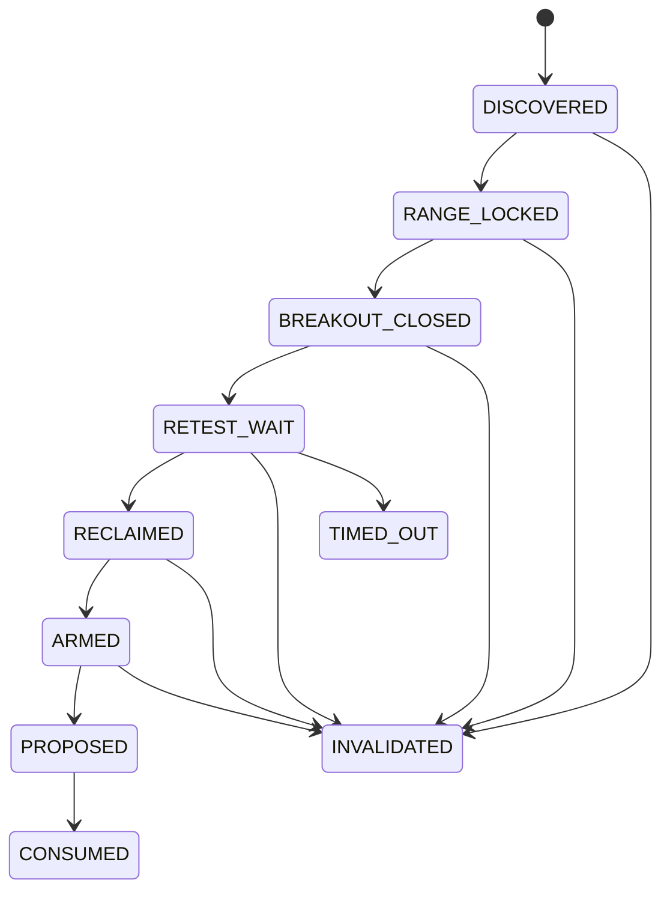

## Context

TossOS에는 continuation, reversal, weekly-value의 KR/US pure lane가 이미 존재한다. 그러나 production 경로는 전략군이 아니라 시장을 worker 단위로 사용한다. `pairedDescriptors`, `LaneInput`, adapter registry와 production route manifest는 6개 lane를 exact set으로 봉인하고, `StrategyMarketWorker`는 시장별 proposal set이 정확히 1개일 때만 `strategyDispatchCycle`로 전달한다. 따라서 현재의 “독립 KR/US”는 시장 장애 격리이지 전략군 장애 격리가 아니다.

이번 change의 목표 topology는 4 families × 2 markets = 8 lane instances다.

| Family | KR lane | US lane | Horizon |
|---|---|---|---|
| continuation | `kr_short_flow_continuation_v1` | `us_short_participation_continuation_v1` | SHORT |
| reversal | `kr_short_absorption_reversal_v1` | `us_short_dislocation_reversal_v1` | SHORT |
| weekly-value | `kr_weekly_disclosure_value_v1` | `us_weekly_disclosure_value_v1` | WEEKLY |
| breakout-retest | `kr_short_breakout_retest_v1` | `us_short_breakout_retest_v1` | SHORT |

여기서 “독립”은 evaluator의 clock/cadence, bounded queue, deadline, health, refusal과 failure latch가 분리된다는 뜻이다. 주문 권위까지 8개로 복제한다는 뜻이 아니다. `(account, market, symbol, position_generation)` owner, account-wide risk, Guardian, journal, dispatch owner/fence, official ExecutionGateway와 safety loops는 계속 하나의 shared authority다.

현 build는 broker-resident protection이 `UNWIRED`다. a100이 완료되어 current market/account capability가 attested되기 전에는 이 change의 모든 exposure-raising execution이 0이어야 한다. change 적용과 runtime 배포는 activation이 아니며 모든 descriptor는 OFF/UNOBSERVED로 시작한다.

## Goals / Non-Goals

**Goals:**

- 네 전략군을 KR/US 각각에서 독립적으로 평가하고 한 lane의 지연·panic·stale evidence·반복 실패를 peer lane에 전파하지 않는다.
- 여러 lane가 같은 symbol에 proposal을 내더라도 active owner 우선과 deterministic fail-closed arbitration으로 최대 하나만 shared dispatch에 전달한다.
- breakout-retest를 closed official bar와 immutable evidence로 재생 가능한 pure state machine으로 구현한다.
- 모든 candidate/proposal/refusal/worker health에 family, lane/version, market, config/evidence digest와 setup lineage를 남긴다.
- 현재 Guardian/q_final/owner/dispatch/protection/exit 계약을 약화하거나 복제하지 않는다.
- 구현 전에 변경할 기존 함수마다 current-base Go AST, FLM, Branch Test Map과 risk-pattern report를 완성하고 TDD로 진행한다.

**Non-Goals:**

- lane, automation gate, autostart 또는 LIVE approval을 자동으로 켜는 것.
- Toss 앱의 수동 조건주문, WTS mutator, paper broker 또는 별도 strategy broker를 자동 주문 권위로 사용하는 것.
- 신규 microservice, 전략별 journal, 전략별 Guardian 또는 전략별 account-wide cap을 만드는 것.
- breakout 첫 touch 매수, 미완성 bar 전이, averaging down, short/leverage, 보호 없는 진입을 허용하는 것.
- a066의 미완료 scale-in/owner-release/loss-lock gate나 a100 protection wiring을 이 change에서 우회 구현하는 것.
- 검증 전 threshold를 시장의 보편적 사실로 주장하거나 성과를 보장하는 것.

## Decisions

### 1. 8개 lane worker와 2개 market coordinator를 둔다

runtime topology는 다음과 같다.

각 worker key는 `(market, family, lane_id, lane_version)`이며 자체 scheduler admission, single-flight cycle, bounded queue, monotonic deadline, consecutive failure counter와 entry-only latch를 갖는다. 구현 타입은 기존 두 시장 worker를 암묵적으로 복제하는 방식이 아니라 명시적인 `FamilyWorker` 8개와 `MarketCoordinator` 2개다. 최신 immutable snapshot 하나를 처리하는 coalescing queue를 사용하고, 느린 worker 때문에 producer나 다른 worker가 기다리지 않게 한다. queue size, deadline, retry/backoff, stale threshold는 server-owned versioned runtime manifest에 양의 유한 값으로 고정한다.

한 process 안에서 goroutine만 8개 만들고 shared mutex를 계속 쓰는 대안은 remote evidence latency와 panic/failure 상태를 결합하므로 배제한다. 반대로 8개 service/process로 분리하는 대안은 journal single-writer와 운영 복잡도를 훼손하므로 배제한다. modular monolith 안의 supervised ports가 적절하다.

### 2. lane worker는 sealed proposal만 만들고 market coordinator가 arbitration한다

Production route authority는 한 candidate를 먼저 고르는 `Route`가 아니라 모든 eligible family candidate를 검증·봉인해 반환하는 `RouteSet`이다. Raw `Candidate.Score` 또는 registry 순서는 cross-family 선택 권위가 될 수 없다. 각 candidate는 자기 pure evaluator를 통과한 뒤에만 mutation capability가 없는 immutable `FamilyProposalEnvelope`가 된다. 필수 preimage는 worker/family/lane/version, account/market/symbol/generation, candidate/setup ID, horizon, evidence/config digest, evaluated-at/fresh-until, entry/stop/target/quantity, raw lane score, common arbitration score/version/calibration digest와 lineage seal이다. invalid field, stale deadline, seal mismatch는 coordinator에서 broker request 0건의 typed refusal로 소비한다.

coordinator는 같은 owner scope의 current envelopes만 모은다.

1. active owner snapshot이 하나면 그 owner와 같은 lane/campaign만 계속 선택한다.
2. active owner가 없으면 eligible이며 desired/effective ON인 proposal만 비교한다.
3. family enum은 `CONTINUATION`, `REVERSAL`, `WEEKLY_VALUE`, `BREAKOUT_RETEST`의 exact set이다. Cross-family 비교는 같은 approved `arbitration_score_version`과 calibration digest에 묶인 integer `score_ppm`(0..1,000,000)만 허용한다.
4. 최고 점수 하나만 router에 전달한다. 최고점 동률, incomparable score, multiple active owner, stale owner revision은 fail-closed refusal이다.
5. 하나의 proposal을 선택해도 journal의 atomic owner/q_final admission과 dispatch lease가 최종 권위다.

기존 `Route`의 raw `int64 Score`와 registry order를 사실상의 전략 우선순위로 사용하는 대안은 단위가 다른 signal을 비교하고 restart/registration 순서에 따라 결과가 달라지므로 배제한다. Production coordinator는 singleton proposal도 approved common score version/calibration digest가 없으면 `ARBITRATION_UNCALIBRATED`로 거부한다. SHADOW projection은 raw score를 counterfactual로 기록할 수 있지만 dispatch 권위를 만들지 않는다.

Coordinator intake는 market 전체에서 proposal 하나를 전제하지 않는다. Owner scope마다 다음 dedup key를 사용한다.

`(account, market, symbol, position_generation, family, lane_id, lane_version, snapshot_digest)`

Queue는 server-owned positive finite capacity를 가지며 같은 key는 newest current envelope로 coalesce한다. 서로 다른 owner scope는 deterministic lexical scope order와 sealed evaluation sequence로 공정하게 진행한다. Overflow는 silent drop이 아니라 stable typed refusal/drop counter를 남기며 active-owner scope를 임의로 축출하지 않는다. 최종 제한은 시장당 하나가 아니라 owner scope당 selected proposal 최대 하나다.

### 3. shared mutation/risk authority는 변경하지 않는다

8개 worker 어디에도 broker mutator, writable journal, Guardian issuer, activation writer 또는 toggle writer를 주입하지 않는다. 두 market coordinator는 하나의 bounded dispatch handoff로 연결되고, `strategyDispatchCycle.dispatch`의 protection/reconciliation/FX/Guardian/q_final/lease/Gateway 순서를 재사용한다.

동일 계좌에는 하나의 account-base Guardian과 하나의 account-wide exposure/loss domain만 둔다. family는 a066의 versioned strategy risk bucket key에 포함되지만 capacity source를 만들지 않는다. 수량은 항상 다음 교집합이다.

`q_final = min(q_candidate, q_guardian, q_horizon, q_market, q_family_policy, q_sector, q_symbol)`

어느 family도 `q_candidate`를 늘리거나 peer family의 미사용 cap을 중복 소유하지 못한다. owner key에 family/horizon을 추가하는 대안은 같은 symbol/generation을 여러 전략군이 동시에 소유하게 하므로 배제한다.

### 4. breakout-retest는 pure closed-bar state machine이다

신규 `internal/breakoutlane`는 KR/US adapter가 공유하는 pure core와 market-specific descriptor를 갖는다. 상태 전이는 다음과 같다.

`INVALIDATED`, `TIMED_OUT`, `CONSUMED`는 terminal이며 같은 setup ID에서 부활하지 않는다. state transition은 official calendar가 정한 regular session의 닫힌 1-minute bar만 사용한다. live quote는 ARMED 뒤 최종 spread/drift/freshness veto에만 사용하며 breakout/retest/reclaim transition의 근거가 될 수 없다.

Setup ID의 canonical byte preimage는 UTF-8 문자열
`tossos.breakout.setup.v1`, `market`, `symbol`, `session_id`, `calendar_version`,
`opening_range_first_bar_id`, `opening_range_last_bar_id`, `lane_id`, `lane_version`,
`config_digest`를 이 순서로 NUL byte (`0x00`) 하나로 join한 값이며 마지막 delimiter는 없다.
각 field는 non-empty canonical value여야 하고 leading/trailing whitespace와 NUL을 거부하며,
hash 단계에서 trim, case fold, Unicode normalization 또는 JSON 재직렬화를 하지 않는다. Setup ID는
그 byte preimage의 SHA-256을 `sha256:` + 64자리 lowercase hex로 표현한다. 이 domain-separated
encoding은 L1/L2/L3가 공유하는 유일한 setup identity authority다.

v1의 server-owned experimental parameters는 opening range 15 regular-session minutes, breakout close buffer `max(1 tick, 100,000 ppm × ATR)`, retest tolerance `100,000..250,000 ppm × ATR`, timeout KR 8/US 10 closed one-minute bars, RVOL threshold 1,500,000 ppm, upper-wick/range veto 350,000 ppm이다. 1,200,000/2,000,000/2,500,000 RVOL counterfactual 결과도 관측에 기록한다. 변경은 새 config/version/digest와 shadow replay 승인을 요구하고 기존 setup을 소급 재해석하지 않는다.

첫 breakout touch 주문, intrabar high만으로 breakout 인정, failed reclaim 뒤 평균단가 낮추기는 금지한다. invalidation close, volume-expanded failed reclaim, timeout, spread/drift/freshness failure는 typed refusal/terminal transition을 만든다.

### 5. evidence producer와 snapshot authority를 evaluator 밖에 둔다

official read-only candle/quote adapter가 regular-session closed bars를 canonical integer minor/PPM payload로 append한다. bar identity는 `(market, symbol, session_id, interval, open_at)`이며 correction은 같은 ID를 덮지 않고 higher revision/new digest로 추가된다. Wire `timestamp`는 봉 **종료** 시각이므로(2026-08-18 KR/US 라이브 실측, 결정 30·31) producer가 `open_at = timestamp − interval`로 변환해 이 identity를 만든다. evaluation은 `recorded_at`과 `source_observed_at` dual cutoff로 봉인한 immutable snapshot만 소비한다.

Current main의 lossless `official.Client.RawMinuteCandles`와 `strategycandle` sealer는 KR 6자리 symbol과 KRX session만 허용하고 US를 명시 거부한다. 따라서 구현 전에 M-B measurement가 official US 1-minute endpoint의 raw decimal/timestamp 보존, pagination, USD currency, regular-session/calendar identity와 rate semantics를 실제 contract/fixture로 고정해야 한다. Generic `Candles`의 float 변환, WTS 응답 또는 테스트 fixture를 production US authority로 승격하지 않는다. M-B가 complete PASS가 아니면 exact 8-lane production matrix와 US breakout producer를 배선하지 않고 OFF/UNOBSERVED로 남긴다.

M-B는 두 단계로 분리한다. M-B0는 기존 KR raw reader나 일반 `Client.get/send`, token refresh, `AttemptTrace/RateBudget`를 넓히지 않고 새 `internal/official/a112_mbus_read*` 파일에만 존재하는 unused measurement seam이다. Factory는 exact `*official.Client` 하나만 받고 같은 instance의 sealed authority origin/transport를 configuration lock 아래 다시 검증한다. caller-supplied origin token, 별도 read provider 또는 cross-client evidence 결합은 금지한다. Seam은 그 transport를 `Proxy=nil`, `DisableCompression=true`, redirect-refusing/GET-only로 clone하고 `Accept-Encoding: identity`를 보내며 Go default User-Agent를 명시적으로 억제한다. Unix에서는 token cache를 descriptor-relative no-follow로 열고 열린 FD를 current-UID regular 0600으로 `Fstat`하며 unsupported platform은 request 전 HOLD한다. 기존 60초 skew의 cached token만 사용해 caller deadline 15초 이하의 GET 한 번만 수행한다. On-wire application header는 `Authorization`, optional `Accept`, `Accept-Encoding: identity`뿐이고 protocol-owned `Host`만 별도로 허용한다. `Content-Length`와 2-MiB-plus-one limiter를 함께 적용하고 non-empty/non-identity `Content-Encoding`을 거부한다. 각 결과는 같은 request의 method/path/canonical query, 최대 2 MiB raw body, response status, `nextBefore` raw JSON과 decoded UTF-8 value bytes, `X-RateLimit-Limit`, `X-RateLimit-Remaining`, `X-RateLimit-Reset`, `Retry-After` 원문을 decode 전에 opaque copy-on-read evidence로 결속한다. Header는 slice cardinality까지 검증하며 duplicate/missing/malformed 값은 HOLD다. 401/403/429/5xx, cache miss/expiry, redirect, body overflow 또는 malformed response는 refresh/retry/fallback 없이 HOLD다. 기존 `RawMinuteCandles`의 US rejection은 회귀 테스트로 유지한다.

M-B0의 production caller는 0개다. Resolved Go-AST selector/reference guard는 M-B0 exported-symbol definition/test와 후속 non-installed exact `tools/a112-mb-us-source` 외의 참조를 거부하고, 특히 `cmd/tossctl`, `strategycandle`, `strategyevidence`, `breakoutlane`, engine/runtime/router/scheduler가 그 symbol을 호출하지 못하게 한다. Pre-existing `internal/official` package import 자체는 금지하지 않는다. M-B1 one-shot collector만 required explicit token-cache path, exact `YYYY-MM-DD` session date/initial cursor와 FD-verified `/tmp` receipt root를 받는다. It constructs default-origin `official.New` with empty credentials and no config/account resolver; only the direct cached-token seam may run. It performs exact `US/AAPL/1m/count=200/adjusted=false` candle, raw AAPL orderbook and explicit-date US calendar. Root/payload는 dir-FD/openat/no-follow/Fstat/O_EXCL/fsync으로 0700/0600을 네트워크 전에 증명한다. Candle은 최대 4페이지, orderbook/calendar는 각 1회, 각 request deadline은 15초, 전체 deadline은 120초이며 15초가 남지 않으면 새 request를 시작하지 않는다. 각 seam 호출은 한 request뿐이다. `nextBefore` decoded UTF-8 value bytes는 trim/casefold/normalization 없이 URL percent-encoding만 한 번 적용해 전달하고 raw JSON은 forensic fixture로 별도 보존한다. Terminal은 raw JSON `null`만 허용하며 absent/empty/number/object/array는 HOLD다. Candle 다음 페이지는 직전 같은-endpoint response의 unique valid headers가 `remaining >= 1`일 때만 허용한다; orderbook/calendar는 single-shot이고 최초 오류에서 전체 plan을 중단한다.

**2026-08-16 amendment (human-approved, run 3 evidence).** Official contract는 `nextBefore null`을 "보유 이력의 마지막 페이지"로, `before` 부재를 "최신 봉부터"로 정의한다. 따라서 빈/세션 말 initial cursor에서 4×200 봉 안에 terminal null을 보는 것은 AAPL 1분봉 이력 전체를 거슬러야 하는 요구라 원리적으로 불가능하고, run 3은 정규장 390/390 봉을 결손 없이 받고도 page 4 cursor가 non-null이라 HOLD했다. Amendment는 4페이지 cap을 **hard request bound**로 유지하되 cap 소진을 HOLD가 아니라 receipt에 `cap_exhausted`로 기록하고 orderbook/calendar/post identity/seal로 계속 진행하게 한다. Candle PASS 기준은 terminal null이 아니라 **explicit regular-session full coverage**다: `--session-date`의 official calendar `regularMarket` 구간(요청한 explicit-date calendar body와 join)에 속하는 모든 1분봉이 raw body에 결손 없이 존재하고, 그 구간 시작 이전 봉이 최소 1개 관측되어 crawl이 세션 시작을 지났음을 증명하며, USD·decimal string·cursor continuity·unique rate headers가 함께 성립해야 한다. Terminal null 관측은 PASS 전제가 아니다 — raw null이 오면 여전히 그것만 terminal로 인정하고 기록하지만, 별도 explicit-cursor terminal probe(`--before`를 아주 과거로, `candles: []`와 raw `null` 기대, ≤1 GET, 별도 사람 승인)는 선택 사항이며 L1 strict decoder는 string/null 외 cursor에 fail-closed한다. Cursor loop, absent/empty/non-string cursor, rate gate 실패, 그 밖의 모든 오류는 변함없이 HOLD다. 권장 initial cursor는 해당 세션의 `regularMarket` 종료 시각(예: `2026-08-15T05:00:00.000+09:00`)이며 빈 cursor 재실행은 같은 결과를 재생산하므로 피한다.

**운영 전제조건(같은 amendment).** 브로커는 credential당 살아 있는 토큰이 하나다(a082). 같은 OpenAPI credential을 쓰는 다른 보유자가 자기 토큰을 발급하면 공유 cache 토큰이 즉시 죽고, cache-only M-B0 seam은 exchange를 못 하므로 무재시도 collector는 첫 request에서 401 HOLD한다(2026-08-16 13:10 실측; 원인은 StockOS `infra-toss-intelligence-1`의 메모리 전용 토큰). 모든 external M-B run 전에 credential 보유자 전원(StockOS toss-intelligence, TossOS engine/httpapi/console 컨테이너, host `tossctl`)을 열거하고 각각이 cache를 공유하거나 정지 상태임을 사람이 확인·기록한다. 이웃 제품 정지는 사람이 승인하는 side effect이고, 지속 해법은 StockOS용 별도 OpenAPI 앱 키다. TossOS token 코드는 변경하지 않는다. `/mnt/D`의 0755 FUSE receipt에는 raw body를 쓰지 않으며 fallback 저장소도 없다.

M-B1은 첫 request 전에 approved exact M-B0/tool production manifest와 tests, `go.mod`/`go.sum`, verified absolute Go/Git binaries, frozen base, tracked diff/untracked content set, machine-derived compiled Go/Cgo/embed closure, prescribed build environment와 executable bytes를 SHA-256으로 봉인한다. 모든 Git 조회는 canonical root에서 vetted absolute binary와 sanitized environment로 실행하고 inherited `PATH/GIT_DIR/GIT_INDEX_FILE/GIT_*`를 authority로 사용하지 않는다. Source identity read는 canonical root 밖을 거부하고 leaf를 `O_NOFOLLOW`로 열어 regular file인지 확인하며, 같은 FD의 device/inode/size/read length를 결속하고 256 MiB 초과를 truncate하지 않고 HOLD한다. Rebuild는 caller `GO*`/`CC`/`CXX`/`CGO`를 상속하지 않고 `GOENV=off`, empty `GOFLAGS`, `GOWORK=off`, `GOPROXY=off`, `GOSUMDB=off`, `CGO_ENABLED=0`, fresh private `GOCACHE`와 verified offline `GOMODCACHE`를 사용한다. `go mod verify` 뒤 machine-readable `go list -json -deps`로 actual compiled input closure를 구하고 exact GOOS-bound allowlist 밖의 compiled/ignored/untracked input을 거부한 뒤 prescribed rebuild SHA가 running executable과 같음을 증명한다. 종료 뒤 같은 identity를 재해시하며 drift는 HOLD다. Raw body는 secure `/tmp`에만 있고 repo `analysis/**`에는 sanitized identity/hash/mode/absence metadata만 기록한다. Source/build identity가 없는 `go run`, caller-claimed build command 또는 ad-hoc binary는 PASS 근거가 아니다.

첫 authorized run은 prescribed `-trimpath` binary가 `runtime.GOROOT()` 절대경로를 제공할 것이라는 잘못된 가정 때문에 request 0건으로 HOLD했다. Repair contract는 required explicit absolute `--go-binary`를 추가한다. 이 leaf는 no-follow regular 안전성, resolved identity와 pre/post SHA를 검증하며 그 동일 binary만 `go env`, `go mod verify`, `go list`와 prescribed rebuild에 사용한다. `runtime.GOROOT`, ambient `GOROOT`, `PATH` 또는 inherited `GO*`는 locator/build authority가 아니며, real trimpath-built collector의 offline identity preflight 통합 테스트가 통과하기 전에는 external measurement를 재실행하지 않는다.

단순 pre/post pathname hash는 실행 identity가 아니다. Go와 Git은 검증된 open FD의 exact bytes를 freshly created current-UID 0700 `/tmp` directory 안 O_EXCL owner-only executable로 복제하고 file/directory fsync와 digest equality를 확인한 private snapshot capability로만 실행한다. Snapshot phase 뒤 original caller pathname을 command 실행용으로 다시 열지 않으며, unexpected entry·mode/owner/content drift는 reader call 0에서 HOLD한다. Machine-derived compiled closure의 tracked dependency는 frozen base, exact tracked diff와 per-input content SHA로 결속하고, M-B0/tool의 untracked production inputs만 exact GOOS allowlist에 제한한다.

Go executable relocation은 별도 GOROOT tree authority를 요구한다. Selected `<go-root>/bin/go`의 distribution은 root-FD에서 descriptor-relative/no-follow로 순회하며 special file과 symlink를 거부하고, 최대 512 MiB/50,000 entries 안에서 각 regular input의 pre/post device/inode/size/read length와 SHA를 결속해 fresh 0700 private root에 O_EXCL owner-only copy로 만든다. Deterministic tree manifest와 모든 file/directory fsync가 완료된 private root만 내부 `GOROOT`가 되며, original/ambient GOROOT는 이후 열지 않는다. Snapshot은 각 Go command 전후 exact entry/mode/owner/content를 재검증하고 모든 success/HOLD 경로에서 정리한다.

이 snapshot과 prescribed identity/rebuild는 collector의 기존 120초 deadline 안에서 완료되어야 한다. Pre-enumerated descriptor-validated inventory에 대한 fixed bounded worker pool만 허용하며, 각 worker의 no-follow source FD·pre/post metadata/digest·O_EXCL destination·file fsync, deterministic directory fsync, sorted manifest, first-error cancellation과 cleanup을 유지한다. Deadline 밖 사전 준비나 durability 완화는 금지한다.

Receipt success는 파일을 썼다는 사실이 아니라 현재 bytes의 완전한 봉인이다. M-B1은 identity, 각 write, seal과 success 전후에 cancellation/overall deadline을 확인하고 정확히 120초부터 HOLD한다. Pinned root/run FD는 seal 진입·종료에 current-UID directory exact0700으로 재검증한다. Payload는 current-UID regular exact0600, 최대 64 MiB이고 동일 FD의 pre/post device/inode/size/read length를 결속해 전체 bytes를 재해시한다. Strictly parsed deterministic manifest는 자기 자신을 제외한 exact entry set과 각 payload digest를 포함하며, manifest write/fsync 뒤 original manifest bytes와 모든 payload를 다시 검증한다. Unexpected entry, chmod/chown, appended tail, payload/manifest drift, overflow는 taint/HOLD다. Sanitized metadata는 exact canonical query를 보존하고, raw JSON은 모든 depth의 duplicate key·invalid UTF-8/surrogate·secret-like key/value를 fail-closed한 뒤에만 저장한다.

M-B0의 injected/process clock은 cached-token expiry와 request/overall deadline enforcement에만 사용한다. 그 값은 official evidence에 직렬화하지 않고 candle finality나 `source_observed_at`을 추론하는 권위로 사용하지 않는다. M-B1의 calendar join은 explicit session date와 raw official response에만 결속하며 local wall clock을 source authority로 승격하지 않는다. 성공 응답에 unique valid Limit/Remaining/Reset header가 없으면 그것이 실제 API 동작이더라도 계약을 약화하지 않고 M-B를 HOLD로 유지한다.

현재 `CandlePageResponse`에는 publisher의 `closed/finalized` flag와 server-observed timestamp가 없다. 따라서 calendar의 regular-session membership과 terminal pagination을 관측해도 candle finality가 자동 증명되지는 않는다. Manager의 M-B PASS는 lossless official US raw source capability와 L1 착수만 허용한다. L1은 append-only evidence에서 `source_observed_at`과 `recorded_at` dual cutoff, session close/correction ordering과 strict decoder를 별도로 RED→GREEN하고 독립 리뷰받기 전까지 US closed-bar authority나 production source acceptance를 만들 수 없다.

Toss 순위·거래대금·거래량·수급 화면에서 얻은 정보는 candidate discovery의 read-only evidence로만 들어올 수 있다. 그것이 breakout close, session, tradability, 수량 또는 주문 권위를 증명하지는 않는다. 모든 전이와 final veto는 current official adapter evidence로 다시 확인한다. Toss 수동 조건주문의 감시 세션·제출·체결 의미를 자동화 권위로 확장하지 않으며, 이 change는 수동 조건주문 생성/관리를 구현하지 않는다.

Breakout payload는 setup/session/calendar identity, opening range high/low, ordered bar IDs/revisions, resistance, ATR, RVOL/counterfactuals, wick/body PPM, state transitions, quote spread/freshness, entry/stop/target/cost assumptions와 config/evidence digest를 포함한다. float, secret-like field, unbounded bar array, unknown enum/field, future/unfinished bar는 strict decoder에서 거부한다.

rolling window/ATR/RVOL cache는 성능 최적화일 뿐 권위가 아니다. cache miss/restart 때 append-only evidence로 동일 결과를 재생해야 한다. 모든 symbol snapshot을 하나의 runtime mutex 안에서 만들거나 lane evaluator가 직접 broker polling하는 대안은 API budget과 failure isolation을 깨므로 배제한다.

### 6. breakout sizing은 costs를 포함하고 Guardian은 다시 축소한다

breakout lane의 candidate sizing은 integer/decimal-safe arithmetic으로 계산한다.

`risk_per_share = (entry - stop) + entry_slippage + exit_slippage + round_trip_costs`

`q_candidate = floor(min(risk_budget / risk_per_share, notional_cap / worst_entry))`

stop이 없거나 `stop >= entry`, target이 break-even/Guardian minimum RR을 충족하지 못하거나 cost/FX/fee/price evidence가 missing·stale·overflow이면 proposal 대신 typed refusal이다. lane가 제안한 q_candidate는 권한이 아니며 a066/Guardian의 q_final가 항상 같거나 작다. stop은 포지션 t0 보호 기준선이고 이후 완화되지 않는다.

breakout의 50/30/20 같은 추가 leg 비율은 이 change의 production 권한이 아니다. v1은 first-leg proposal 하나만 기존 a072 dispatch로 전달한다. a066의 scale-in lifecycle 잔여 task와 별도 승인된 spec이 완료되기 전 추가 leg mutation은 0건이다.

계좌의 1%, KR/US 자본 비중, 최근 5일 승률 또는 시장 상태 배수를 코드 기본값으로 추가하지 않는다. Risk budget과 notional cap은 기존 audited Guardian/activation policy에서만 오고, 성과 기반 완화는 비용 후 기대값·표본 수·drawdown과 사람 승인을 다루는 별도 optimization/activation change의 책임이다.

### 7. lane failure는 entry-only이며 safety loop와 peer lane를 취소하지 않는다

worker fault 분류와 효과는 다음과 같다.

| Fault | Effect |
|---|---|
| stale/missing lane evidence | 해당 lane cycle refusal, peer lane 계속 |
| queue overflow/coalescing | 해당 lane newest snapshot 유지, dropped count 기록 |
| deadline/ordinary error | 해당 lane failure counter 증가, bounded retry |
| panic/unexpected return/repeated threshold | 해당 lane effective entry latch OFF, recovery evidence 필요 |
| market calendar/activation failure | 해당 market의 affected entry workers만 WAIT/OFF |
| journal/Gateway/fence/owner integrity fault | 모든 신규 entry fail-closed |
| exit/fill/reconcile/protection degradation | 기존 engine-safety 계약에 따라 entry block; safety retry 계속 |

lane context와 safety context를 분리한다. lane OFF, market close, candidate budget exhaustion, breakout producer failure가 fill detection, reconciliation, broker-resident protection supervision, exit observer 또는 emergency reduction을 취소하거나 그 API budget reserve를 소비해서는 안 된다.

### 8. configuration과 activation은 exact matrix/digest로 봉인한다

production manifest는 각 market의 exact four descriptors와 family identity, lane/version, horizon, evidence schema, runtime policy, scoring/calibration과 config digest를 검증한다. missing, duplicate, unknown, partial 3-of-4, legacy 3-lane ON manifest는 새 권위로 자동 승격하지 않고 해당 새 runtime을 OFF로 유지한다.

기존 승인 manifest를 묵시적으로 4-family 승인으로 migration하는 대안은 승인 범위를 넓히므로 배제한다. 새 runtime activation은 exact 4-family-aware signed manifest가 필요하다. descriptor deployment만으로 desired/effective state를 ON으로 만들지 않는다.

`OFF/OFF/UNOBSERVED`와 `SHADOW`는 다른 상태다. 새 설치·migration·restart는 전자를 유지한다. SHADOW는 server-owned signed shadow manifest가 명시된 경우에만 read-only evaluation/counterfactual projection을 허용하며 desired/effective/activation을 ON으로 만들거나 dispatch capability를 가질 수 없다. Restart는 과거 process-local shadow 상태를 복원하지 않는다.

### 9. 구현은 다음 모듈 경계를 따른다

| Area | Planned change |
|---|---|
| `internal/breakoutlane` | pure types, state transition, sizing, KR/US adapters, fixtures/property tests |
| `internal/strategyevidence` | additive breakout evidence kind, strict schema/parser, closed-bar snapshot tests |
| `internal/strategyflow` | 8 descriptors, two tagged inputs/constructors, registry adapters, lineage/refusal tests |
| `internal/strategyrouter` | exact four-per-market manifest, family/scoring seal, all-candidate RouteSet, family quota와 post-evaluation arbitration compatibility tests |
| `internal/strategyproposal` | explicit breakout input assembly and no-fallback production scope validation |
| `internal/app/engine` | lane worker supervisor, two coordinators, bounded handoff, lane health/latch projection |
| console/API projection | legacy market-level fields를 보존하면서 fixed-order `lanes[8]`와 `coordinators[2]`를 additive로 노출하는 read-only family/worker/refusal/lineage status; no activation minting |

`strategyDispatchCycle.dispatch`, Guardian, Gateway and safety loops are reuse-first boundaries. 기존 함수를 수정해야 한다면 CodeGraph caller/callee/impact와 AST/FLM/BTM/risk pattern을 current base에서 먼저 고정한다. 새 coordinator를 기존 market worker에 숨겨 넣어 `len(entries)==1` 계약을 우회하지 않고 명시적 type/port로 모델링한다.

### 10. 구현 권위와 리뷰 권위를 로트별로 분리한다

SOL/Manager는 proposal/design/spec/tasks, 분석 증거와 acceptance 기록만 편집한다. Production 코드와 테스트는 Terra 구현 에이전트가 담당하고, 각 구현 로트는 그 구현자와 다른 Terra 적대 리뷰어가 read-only로 검토한다. 구현자가 reviewer의 P0/P1을 수정하고 같은 reviewer가 재검토하기 전에는 다음 의존 로트를 시작하지 않는다.

로트 경계는 `tasks.md`의 L0–L7 ownership table이 정본이다. 공유 파일이 필요하면 구현자가 임의로 범위를 넓히지 않고 Manager가 먼저 OpenSpec ownership을 수정한다. 이 절차는 동시 편집 충돌 방지뿐 아니라 worker가 shared dispatch, Guardian, journal 또는 activation 권위를 우연히 획득하는 것을 방지하는 설계 통제다.

최종 acceptance는 개별 unit test 통과만으로 성립하지 않는다. 모든 로트의 separate adversarial verdict가 P0/P1=0이고, post-edit AST/FLM/BTM/risk가 current source와 일치하며, final gstack review와 repository gates가 통과하고, Manager가 exact 8-lane/2-coordinator/1-mutation-authority 계약을 source·test·spec에서 독립 대조해야 한다.

## Risks / Trade-offs

- [8개 worker가 같은 evidence/API budget을 과다 소비] → producer fan-out과 immutable snapshot 공유, family-scoped capability, one physical quota authority와 safety reserve를 사용한다.
- [서로 다른 전략 score를 잘못 비교] → approved common PPM/version/calibration 없이는 cross-family arbitration을 거부하고 동점도 fail closed한다.
- [한 symbol에 중복 주문] → horizon/family 없는 owner key, market coordinator one-winner와 journal atomic owner/q_final admission의 이중 방어를 사용한다.
- [shared refresh mutex가 모든 lane를 막음] → remote I/O를 critical section 밖 producer로 이동하고 per-lane bounded queue로 전달한다.
- [breakout threshold overfit] → 수치를 experimental config로 versioning하고 counterfactual/shadow replay를 gate로 두며 자동 완화를 금지한다.
- [bar correction이 과거 state를 바꿈] → append-only revision과 snapshot digest로 평가 시점을 봉인하고 terminal setup을 소급 부활시키지 않는다.
- [독립 failure를 중앙 integrity fault로 오분류] → typed fault table과 unit/fault-injection tests로 lane-local, market-local, central 범위를 고정한다.
- [a066/a100 미완료 상태에서 주문 경로가 열림] → explicit dependency gate, OFF defaults, protection attestation과 broker spy zero-call 테스트를 완료 조건으로 둔다.
- [추가 goroutine/telemetry 부하] → bounded cardinality(정확히 8), coalescing queues, no unbounded label(setup ID는 metric label 금지), race/leak/latency budget tests를 둔다.

## Migration Plan

1. current base에서 모든 high-risk edit target의 CodeGraph/AST/FLM/BTM/risk evidence와 exact 6-lane regression을 고정한다.
2. M-B가 닫히기 전에도 pure breakout core를 fixture-only input port로 RED→GREEN할 수 있다. 이 포트는 production source authority로 배선할 수 없고 broker/journal/activation dependency closure가 없어야 한다.
3. M-B0 unused measurement seam을 별도 Terra RED/GREEN·적대 리뷰·gstack·Manager 검증으로 수락한 뒤에만 M-B1 one-shot collector를 열 수 있다. 둘 다 activation이나 L1 production caller를 만들지 않는다.
4. Manager가 bounded M-B1 receipt를 PASS로 기록한 뒤 official KR/US lossless source와 L1 strict dual-cutoff evidence schema를 구현한다. M-B PASS만으로 L1 acceptance나 closed-bar finality를 주장하지 않는다.
5. L1 acceptance 뒤 canonical registry/RouteSet/production manifest를 exact 8 descriptors로 확장한다. partial matrix와 legacy manifest는 OFF/refusal로 남긴다.
4. family quota와 owner-scope post-evaluation arbiter를 먼저 검증한 뒤 8 FamilyWorker/2 MarketCoordinator를 dormant/shadow로 배선한다. existing shared dispatch handoff는 prerequisite가 닫힐 때까지 spy로 막고 fault injection, race, queue/backpressure, deterministic replay를 검증한다.
5. a064/a066/a070/a072 적용 상태와 a100 ProtectionReady를 dependency matrix로 확인한다. 어느 prerequisite도 missing이면 effective entry 0을 증명한다.
6. A100 ProtectionReady와 모든 dependency gate가 완료된 경우에만 signed four-family activation/calibration manifest 없이 OFF/UNOBSERVED 상태로 dormant 배포하고 shadow 관측과 counterfactual 결과만 수집한다. A100 product gate가 미완료이면 build-only와 offline/shadow fixture까지만 허용하고 container replacement는 차단한다.
7. 별도 운영 승인 change에서 검증된 market/lane만 단계적으로 활성화한다. rollback은 lane desired/effective OFF와 worker stop만 수행하며 shared safety loops, owner/reservation lineage와 broker-resident protection은 유지한다.

## Open Questions

없음. arbitration calibration과 운영 threshold는 구현자가 추정하지 않으며, 이 change의 task가 요구하는 shadow evidence와 사람 승인 manifest가 없으면 해당 lane는 OFF로 남는다.
