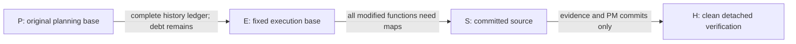

## Context

This is a one-time workflow migration for a063, not a general way to recapture
change baselines. The user approved resolving the common SDD blocker separately.
The root checkout retains unfinished a063 implementation and a119 document
repairs; a120 implementation and its gate run in an isolated detached worktree.

## Goals / Non-Goals

**Goals:** preserve the original planning commit; make the inherited committed
range visible; require a fixed, reviewed execution comparison and every resulting
function bundle; reject dirty or substituted source snapshots; retain default
behavior for every ordinary change.

**Non-Goals:** prove historical pre-edit compliance, declare inherited functions
fully analyzed, waive tests or operational acceptance, support arbitrary future
baseline migrations, or activate any runtime process.

## Decisions

### 1. Fix the exception in code

The only supported tuple is:

- change: `a063-align-attestation-renewal-profile`
- P (unchanged planning base): `da80ce31b6a1ab5d443016768f970a82bab102db`
- E (execution comparison): `e65e394bf84b3c6e4559a219e816af96d341d75d`

The record path is fixed to
`openspec/changes/a063-align-attestation-renewal-profile/execution-baseline.json`.
The actual sibling `base-commit.txt` must be a regular committed file containing
the full allowlisted P; a substituted, abbreviated or symlinked base fails.
An absent `execution-baseline.json` preserves the existing P comparison. A
present invalid record fails closed; it must never fall back to P or silently
choose HEAD. Another change or another P/E tuple is rejected. Any future
extension needs its own explicit spec and code review.

This fixed E prevents choosing a later baseline to hide implementation. The
exception changes the historical acceptance policy explicitly; its result must
be called `execution-baseline adoption exception`, not original pre-edit compliance.

### 2. Separate source snapshot from evidence commits

S is a full immutable source commit descended from E. H is the detached HEAD
where acceptance is checked. Require P <= E <= S < H by Git ancestry (S must
be a strict ancestor of H). P, E and
S must be full commit IDs, not names or abbreviated refs. The record contains S
and its Git tree ID, not H, avoiding a self-referential commit hash.

Between S and H, tracked changes may occur only in `openspec/` and `docs/pm/`.
All staged and unstaged tracked changes are rejected at acceptance. The record,
ledger and both review documents must be regular repository-contained files with
exactly the bytes committed at H; symlinks and parent-path escapes are rejected.
Run the actual adoption check in a detached worktree. The normal checker remains
usable on dirty worktrees when no exception record is present.

Reject any filesystem `.go` file not tracked by S, including ignored Go files,
symlinks and staged additions. Tracked Go modes, paths and blob contents must
match S; absent or renamed source fails. Filesystem traversal must not follow
symlinks or inspect the Git administrative directory. This prevents ignore rules
from hiding code that the reviewed snapshot did not contain.

Untracked/ignored non-Go inputs are also rejected. The only exceptions are
regular non-executable generated data at these fixed locations:
`.codegraph/**`, `.sdd/index-state.json`, `.sdd/gbrain-home/**`,
`.sdd/history/checkpoints/**`, `.sdd/history/refresh-queue/**`,
`.sdd/history/index-refresh.lock`, direct `.sdd/history/events/*.jsonl`, and direct
`*.pyc` files inside `tools/**/__pycache__/` or `auth-helper/**/__pycache__/`.
No untracked evidence documents or arbitrary `.sdd/` locations are exempt.
Use lstat without following symlinks. Even in these locations, reject executable
files, symlinks, and source/object/library suffixes `.go`, `.py`, `.sh`, `.c`,
`.cc`, `.cpp`, `.cxx`, `.m`, `.h`, `.hh`, `.hpp`, `.hxx`, `.s`, `.f`, `.for`,
`.f90`, `.swig`, `.swigcxx`, `.syso`, `.o`, `.a`, `.so`, `.dylib`, `.dll`
(case-insensitive).

Additionally execute `go list -deps -test -json ./...` and the same command with
`-tags tossos_testseams`. Any command or JSON failure blocks adoption. For each
repository-local package, resolve Dir plus GoFiles, CgoFiles, CompiledGoFiles,
IgnoredGoFiles, IgnoredOtherFiles, CFiles, CXXFiles, MFiles, HFiles, FFiles,
SFiles, SwigFiles, SwigCXXFiles, SysoFiles, TestGoFiles, XTestGoFiles, EmbedFiles,
TestEmbedFiles and XTestEmbedFiles. Any extra file that is a listed input fails
regardless of its allowed metadata location or suffix. These fields were checked
against the installed `go help list`. The existing external Go toolchain/module
cache is outside this repository-source lock; no new environment reproducibility
claim is made.

### 3. Record complete deterministic provenance

Use a versioned JSON record at the change root and a separate JSON history ledger
under its analysis directory. Exact field names belong to the implemented schema
and CLI help; the contract requires:

- schema 1, exact change/P/E/S identifiers and S tree ID;
- `pre_edit_provenance` equal to `retrospective-exception`;
- the complete ordered P..E commit IDs, path/status changes, and checker-derived
  modified-existing Go function inventory at E, with a stable canonical digest;
- complete E..S changed Go paths and modified-existing function inventory,
  including source hash and current/base revision; no omitted rows;
- ledger path and SHA-256, plus two distinct adoption-review paths and SHA-256
  values, one adversarial and one subsequent gstack;
- explicit inherited-history disposition: committed history outside resumed
  execution, whose absent historical FLM remains debt, not completed evidence.

Canonical serialization is UTF-8 JSON with sorted object keys, compact separators,
`ensure_ascii=True`, and no trailing newline in digest input. Array order is
significant. The history uses `git rev-list --topo-order --reverse E --not P`;
for each commit it records the full parent list in Git order and NUL-delimited,
no-rename path/status differences against EACH parent. Root commits use the empty
tree. Parent comparisons include merge parents outside the enumerated range:
merges and reverted intermediate paths must remain visible. Path/status records
are sorted by repository path and status. Git filenames must be decoded losslessly
or rejected explicitly; no whitespace splitting is permitted.

The function inventory is explicitly the ordinary checker's NET modified-existing
inventory at endpoints P/E (and E/S), not an inventory of every intermediate
function body. Sort rows by repository path and qualified function; each row
contains path, function, required current/base revision, and full source SHA-256.
This serializer must be defined once and shared by generator/validator.
The validator recomputes both ranges from immutable Git objects using the same
function derivation as the ordinary checker. Count/digest assertions alone are
insufficient: ledger entries must exactly equal the recomputed inventories.
Unknown schema/fields, duplicate JSON keys, missing/duplicate/altered rows,
malformed digests and paths outside the current change fail closed.

The generator emits reviewable ledger/record drafts only. It never rewrites P,
creates an approval claim, commits, resets, cleans, or mutates runtime state. It
refuses overwriting existing output. Review files are evidence of actual separate
review passes, not an automatic approval created by the generator.

### 4. Preserve every resumed implementation obligation

After validating the adoption envelope, `check_analysis` uses E for the ordinary
full-worktree modified-function derivation. Every resulting function still needs
the existing source-hash, revision, branch, call and test-citation checks.
E..worktree obligations must equal the recorded E..S inventory. Existing duplicate
evidence and conflicting local/reference rules remain enforced. `SDD_BASE_REF`,
if set, must resolve to the selected effective base: P ordinarily, E only for a
valid exception. It cannot itself select that base.

The E..S Go path set is also restricted to the reviewed a063 surfaces:
`cmd/tossctl/soak.go`, `cmd/tossctl/soak_test.go`,
`internal/soak/attest.go`, `internal/soak/attest_test.go`,
`internal/soak/renewal_status.go`, `internal/soak/renewal_status_unix.go`,
`internal/soak/renewal_status_other.go`, `internal/soak/renewal_status_test.go`,
`internal/soak/renewal_status_unix_test.go`, `internal/console/data.go`,
`internal/console/templates.go`, `internal/console/console_test.go`.
Unrelated new product Go paths fail even if someone supplies extra maps.

Keep implementation localized to a helper plus the checker integration. Extend
immutable-target function extraction only if necessary to produce real P..E and
E..S inventories. Inventory generation must not switch the caller's checkout.
Python edits receive Python AST/pre-edit maps; Go product sources are untouched
in a120, so its ordinary Go-map exemption is documented explicitly.

### 5. Keep the SDD interpreter outside an adopted source snapshot

Final integration review found that `sdd_doctor` requires a repository-local
`.sdd/.venv`, while the adoption source guard correctly rejects that environment's
untracked source and symlinks. A normal a120 check with that venv did not prove
that an adopted a063 could pass the full gate. This amendment fixes the
integration without relaxing the source guard.

Add optional `SDD_PYTHON` to the doctor only. When absent, retain the existing
local `.sdd/.venv/bin/python` behavior and ordinary setup command. When present,
require a nonempty absolute interpreter path outside the repository both
lexically and after symlink resolution. An external venv interpreter symlink
to an external interpreter is allowed. Missing, non-executable, directory,
inside-repository or invalid explicit paths fail closed without local fallback.
The explicit external interpreter must successfully probe the `typedb-driver`
version pinned by `tools/sdd/requirements.txt`; missing or mismatched versions
fail. A missing, malformed, multiple or non-exact driver pin also fails in
explicit mode. Test environment membership, not truthiness, so an explicitly
empty variable cannot choose the default. Report mode, raw/resolved interpreter
and the dependency result, including failed explicit selections. Do not change
the default local probe's compatibility behavior in this amendment.

Document creation of an external tooling environment using the existing pinned
requirements and pass `SDD_PYTHON` to SDD/gate commands. Do not modify services,
global Python packages, ownership locks or the original planning base. Do not
create a local venv in an adopted worktree. No environment path may select E,
hide source files or bypass any adoption check.
This is doctor-only routing. The advisory `refresh_indexes.py` interpreter
selection is unchanged; do not describe the option as global SDD interpreter
routing or alter advisory ownership/recovery behavior.

Before editing the doctor's existing function, capture its CodeGraph and Python
AST/function/branch evidence. Require separate adversarial amendment review and
gstack plan review before implementation, then independent implementation and
gstack delta reviews. Test absent/default behavior, valid external selection,
invalid explicit values/no fallback, external interpreter links, pinned version
failure and a real adoption fixture that remains source-clean while the external
dependency probe succeeds. Final actual SDD/check/gate commands must use the
reviewed environment mode. Preserve the earlier normal-mode test evidence as
such; it is not proof of adopted-worktree feasibility.

## Risks / Trade-offs

- Historical acceptance policy changes → narrow exact tuple, complete visible
  history/debt ledger, independent reviews and explicit exception terminology.
- A fabricated later baseline could hide code → E is fixed in reviewed code.
- Snapshot drift could invalidate tests → clean detached H, S source lock and
  complete untracked/ignored input guard; only enumerated generated metadata is
  allowed and it may not become a Go build input.
- File hashes or JSON metadata could be substituted → committed regular files,
  canonical recomputation, strict paths/schema and negative Git-fixture tests.
- Git/AST extraction is expensive → do it once per required range per check;
  do not add a cache that can bypass source validation.
- a063 operational acceptance is still outstanding → do not mark its operational
  tasks or archive merely because the new analysis check can pass.

## Migration Plan

1. Freeze this proposal, capture a120's own P, gather hard evidence and pre-edit
   Python maps, then implement/test through Terra with a separate adversary.
2. Run post-adversarial gstack review, a120 checks and gate in its isolated
   worktree, then Manager acceptance and normal PM/spec archive.
3. Integrate only the reviewed common-tool/docs changes, preserving root a063
   edits. Prepare a detached a063 source S from the reviewed implementation.
4. Generate the inherited ledger, regenerate all E-based maps honestly, obtain
   separate adoption reviews, commit the record/evidence at H and execute the
   effective-base analysis there. Preserve original P-based analysis history.
5. Continue a063's remaining operating-profile/approval/real evidence tasks.

Rollback of the tooling restores the ordinary P-based checker and blocks a063
again; it cannot affect trading or delete historical evidence. No automatic
exception record removal or original-base rewrite is part of rollback.
